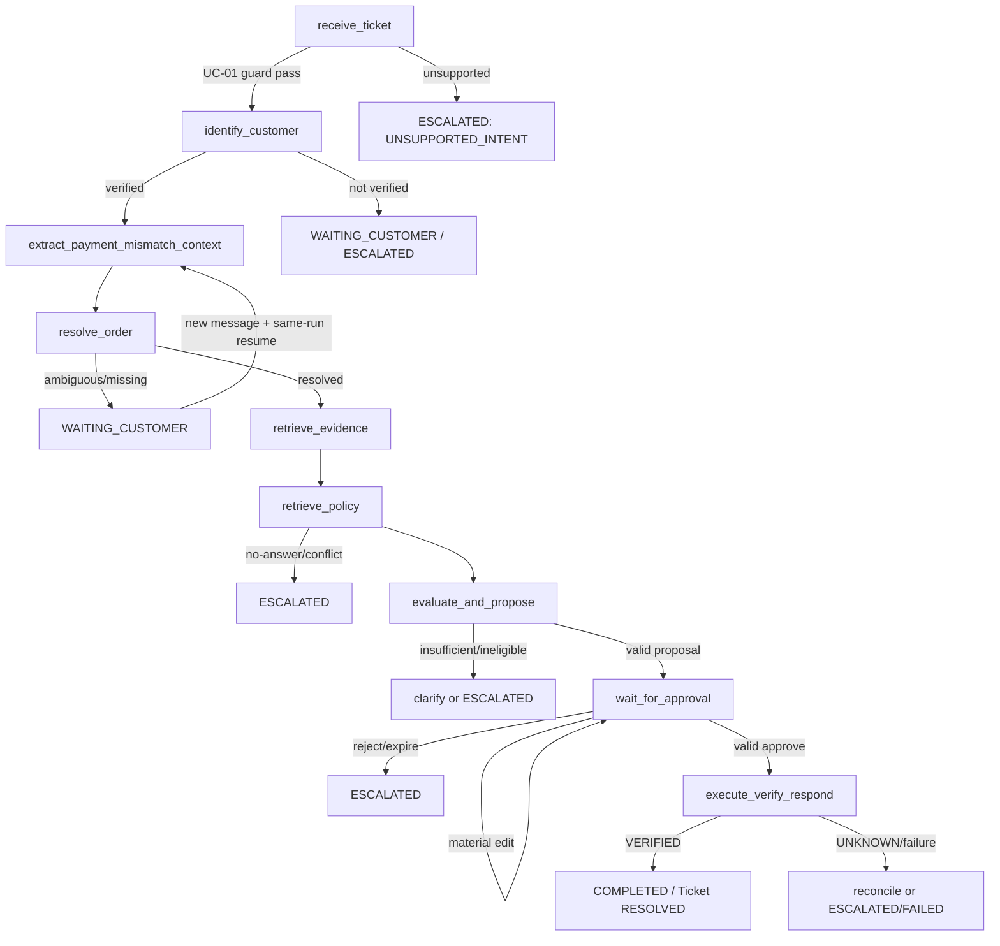
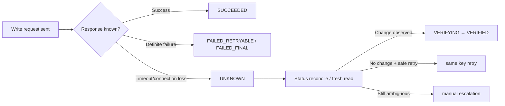

# SupportPilot — Agent Workflow

> Trạng thái: normative workflow design dẫn xuất từ [PLAN.md](./PLAN.md). Business rules vẫn thuộc deterministic domain/policy services.

## 1. Agent responsibilities

- Normalize Ticket context và nhận diện untrusted content.
- Xác định verified customer context từ backend-provided principal.
- Trích xuất các field cần cho UC-01 Payment Mismatch.
- Resolve order trong customer scope.
- Thu thập order/payment evidence qua allowlisted HTTP tools.
- Retrieve active policy citations qua RAG.
- Gọi deterministic policy engine rồi tạo grounded proposal/response khi cần.
- Interrupt chờ approval, resume từ validated backend event.
- Execute approved action, verify fresh target state và cập nhật Ticket qua domain service.
- Persist checkpoint, run summary, timeline/evidence/tool/action records và audit hooks đúng ownership.

## 2. Agent không được làm

- Xử lý UC-02–UC-07 trong v0.1.
- Tự chọn/sửa customer ID, approval actor, URL hoặc arbitrary tool.
- Đọc commerce tables/repository trực tiếp.
- Dùng RAG để tìm order/payment state.
- Override deterministic eligibility/business rules bằng LLM output.
- Execute business write thiếu valid, non-expired approval.
- Blind retry possible write hoặc claim success trước verification.
- Gọi `update_ticket_status` trực tiếp từ LLM; transition thuộc domain service.
- Lưu/expose chain-of-thought hoặc checkpoint payload.
- Truy cập arbitrary HTTP/SQL/filesystem/shell/code execution.

## 3. AgentState contract

Checkpointed state tối thiểu gồm:

| Nhóm | Nội dung |
|---|---|
| Identity | Ticket ID, Agent Run ID, correlation ID, authenticated customer scope. |
| Context | Normalized Ticket/message context, untrusted-content markers. |
| Extraction | Intent, confidence/guard result, entities, missing fields. |
| Resolution | Order candidates, component scores, selected order hoặc clarification state. |
| Evidence | Business API evidence và exact source references. |
| Policy | Citations, vector/lexical scores/gates, conflicts, embedding/index provenance. |
| Decision | Evidence sufficiency và deterministic rule results. |
| Proposal | Proposed actions, immutable version/hash references, response draft. |
| Approval | Approval ID/status/version/hash/expiry. |
| Execution | Action Execution ID/status/result/verification. |
| Operation | Retry/error summaries, graph/prompt/tool/provider versions, deadline và remaining budget. |

State không chứa chain-of-thought. `agent_runs.state_summary` chỉ là redacted public/operational projection, không full copy.

## 4. Checkpoint và thread ownership

- LangGraph checkpoint là nguồn duy nhất để resume graph.
- `thread_id = agent_run.id`.
- Checkpoint không public API, không UI timeline và không audit log.
- `agent_runs` giữ overall business/operational status.
- `agent_run_events` giữ append-only timeline.
- `audit_logs` giữ append-only security/business audit.
- Events/audit không được dùng reconstruct checkpoint.

Chi tiết persistence tại [DATABASE_DESIGN.md](./DATABASE_DESIGN.md#11-checkpoint-ownership-và-reconciliation).

## 5. Active graph profile v0.1

```text
receive_ticket
→ identify_customer
→ extract_payment_mismatch_context
→ resolve_order
→ retrieve_evidence
→ retrieve_policy
→ evaluate_and_propose
→ wait_for_approval
→ execute_verify_respond
```



Intent v0.1 do endpoint/use-case configuration + deterministic guard xác định. Không có LLM classification call riêng.

## 6. Node contracts v0.1

| Node | Input → output | Tools/LLM | Failure/routing |
|---|---|---|---|
| `receive_ticket` | Ticket/messages → normalized context + injection flags + UC-01 guard | Deterministic | Empty/invalid typed failure; clear non-UC-01 → `UNSUPPORTED_INTENT` escalation. |
| `identify_customer` | Auth principal → verified customer scope | Support customer service; no commerce | Không verified: request identity/stop before commerce read. |
| `extract_payment_mismatch_context` | Context → order ID/product/amount/time/transaction ref/missing fields | Tối đa một structured Gemini call khi cần | Malformed output bounded retry; missing info → clarification. |
| `resolve_order` | Customer + entities → selected order/candidates/score | Customer-scoped Order/Payment HTTP reads + deterministic scorer | Ambiguous → safe clarification; no cross-customer lookup. |
| `retrieve_evidence` | Resolved order → order/payment evidence | Allowlisted HTTP reads | Timeout/mismatch → bounded retry then manual/escalation. Persist từng tool call/event. |
| `retrieve_policy` | Context filters → gated citations/conflict/no-answer | RAG | One retry; no gate/conflict → no-answer/escalation. |
| `evaluate_and_propose` | Evidence + policy → deterministic eligibility + immutable proposal | Policy engine first; tối đa một grounded LLM proposal/response call khi cần | LLM không override rule; unsupported action/insufficient evidence → escalation. |
| `wait_for_approval` | Proposal version/hash → approval ID/status/expiry | Approval service + LangGraph interrupt | Resume chỉ validated backend event; reject/expiry escalates; material edit waits again. |
| `execute_verify_respond` | Approved proposal → action/verification/response/Ticket result | Approved write HTTP, fresh read, domain transition; optional grounded response already budgeted | `UNKNOWN` reconcile; failed verify không resolve; persist each internal action/event. |

Audit logging chạy tại service/middleware/event hooks ở mọi boundary, không phụ thuộc một terminal graph node.

## 7. v1.0 target graph mapping

V0.1 không implement các target nodes như những calls độc lập nếu đã gộp:

| Target node | Mapping v0.1 | Status |
|---|---|---|
| `receive_ticket` | Same + deterministic UC-01 guard | Active |
| `identify_customer` | Same | Active |
| `classify_intent` | Guard trong `receive_ticket`; no LLM | v1.0 only |
| `extract_entities` | `extract_payment_mismatch_context` | Merged/active |
| `resolve_order` | Same | Active |
| `request_missing_information` | Conditional pause trong extraction/resolution | Merged/active |
| `retrieve_business_data` | `retrieve_evidence` | Merged/active |
| `retrieve_policy` | Same | Active |
| `evaluate_evidence` | `evaluate_and_propose` policy-engine step | Merged/active |
| `generate_resolution_plan` | `evaluate_and_propose` grounded proposal step | Merged/active |
| `check_approval_requirement` | `evaluate_and_propose`/approval service | Merged/active |
| `wait_for_approval` | Same | Active |
| `execute_action` | Internal step of `execute_verify_respond` | Merged/active |
| `verify_action` | Internal step of `execute_verify_respond` | Merged/active |
| `generate_customer_response` | Internal/grounded response step | Merged/active |
| `update_ticket` | Domain-service step after `VERIFIED` | Merged/active |
| `write_audit_log` | Service/middleware/event hooks | Not a terminal node in v0.1 |
| `handle_failure` | Typed orchestration routes/hooks | Active infrastructure |

Full target nodes may activate with UC-02–UC-05 in v1.0 only after scope review.

## 8. Conditional routing

| Condition | Route |
|---|---|
| Clear non-payment-mismatch content | `ESCALATED`, failure `UNSUPPORTED_INTENT`. |
| Customer not verified | Stop before commerce access; request identity or escalate. |
| Required extraction fields missing | Ask bounded clarification; `WAITING_CUSTOMER`. |
| Candidate score ≥85, unique, margin ≥15 | Select order and persist score evidence. |
| Score 60–84, margin <15 or multiple candidates | Safe clarification; `WAITING_CUSTOMER`. |
| Score <60/no candidate | Ask more or manual review. |
| API evidence insufficient/mismatched | Clarify/escalate; no proposal write. |
| RAG no gate or policy conflict | No-answer/escalate; no LLM policy selection. |
| Valid proposal | `WAITING_APPROVAL`. |
| Reject/expiry | `ESCALATED`; no action. |
| Material edit | New version/hash/TTL; remain waiting reapproval. |
| Approved + verified | Response persist, run `COMPLETED`, Ticket `RESOLVED`. |
| Possible write unknown | Action `UNKNOWN`; reconcile/verify; Ticket not resolved. |

## 9. Clarification và same-run message resume

1. Agent stores missing fields/candidate summary in checkpoint and transitions run/Ticket to `WAITING_CUSTOMER`.
2. UI presents only masked order number/date/product/amount needed to distinguish.
3. API pre-validates `attachment_references`: omitted/`[]` hợp lệ; non-empty trả `422 ATTACHMENTS_NOT_SUPPORTED` trước transaction, không persist message/idempotency-success, không fetch/store và không resume.
4. Với request hợp lệ, `POST /tickets/{id}/messages` commits message trước khi resume.
5. If Ticket/run are both waiting and checkpoint exists, lock/check states, set processing/running and resume **same** run/thread.
6. Resume gets a fresh 60-second advance budget.
7. Timeout does not rollback committed message; run `FAILED`, Ticket `ESCALATED`, audit timeout.
8. Missing/inconsistent checkpoint: keep committed message, do not create new run; escalate/audit invariant.

## 10. Approval interrupt/resume

- Proposal snapshot/version/hash và evidence references persist trước interrupt.
- Approval expires after `APPROVAL_TTL_HOURS=24` absolute UTC hours; lazy detection must persist `EXPIRED`.
- Decision checks role, status, expiry, expected version/hash in row lock/transaction.
- Approve resumes with fresh 60-second budget.
- Reject or expiry never executes action.
- Material edit (target/amount/currency/type) creates immutable proposal version/hash, resets TTL and requires reapproval.
- Non-material edit can approve same request without extending TTL.
- Approval does not grant arbitrary tool/target; execution revalidates schema, HTTP ownership and rules.

API shape: [API_CONTRACT.md](./API_CONTRACT.md#14-approval-decision-contract).

## 11. State machines

Canonical vocabularies dùng thống nhất với database và API:

- Ticket: `OPEN`, `PROCESSING`, `WAITING_CUSTOMER`, `WAITING_APPROVAL`, `ESCALATED`, `RESOLVED`, `CLOSED`.
- Agent Run: `CREATED`, `RUNNING`, `WAITING_CUSTOMER`, `WAITING_APPROVAL`, `EXECUTING`, `VERIFYING`, `COMPLETED`, `ESCALATED`, `FAILED`; không `CANCELLED` trong v0.1.
- Approval: `PENDING`, `EDITED_PENDING_REAPPROVAL`, `APPROVED`, `REJECTED`, `EXPIRED`, `SUPERSEDED`, `CONSUMED`, `INVALIDATED`.
- Action Execution: `PENDING`, `RUNNING`, `SUCCEEDED`, `VERIFYING`, `VERIFIED`, `FAILED_RETRYABLE`, `FAILED_FINAL`, `UNKNOWN`.
- Tool Call: `PENDING`, `RUNNING`, `SUCCEEDED`, `FAILED`, `TIMED_OUT`.
- Notification: `DRAFT`, `DELIVERED`, `FAILED`; Audit result: `SUCCEEDED`, `DENIED`, `FAILED`.
- Evidence kind: `COMMERCE_API`, `POLICY_CHUNK`, `CUSTOMER_MESSAGE`, `DOMAIN_RULE`; permission tier: `BACKEND_SCOPED`, `SAFE_READ`, `BUSINESS_WRITE`, `INTERNAL_WRITE`.

### 11.1 Ticket

| From | To | Condition |
|---|---|---|
| `OPEN` | `PROCESSING` | Explicit Agent Run starts. |
| `PROCESSING` | `WAITING_CUSTOMER` | Missing identity/order/evidence. |
| `WAITING_CUSTOMER` | `PROCESSING` | New message committed and same run resumes. |
| `PROCESSING` | `WAITING_APPROVAL` | Valid business proposal. |
| `WAITING_APPROVAL` | `PROCESSING` | Valid approval or non-material edit+approve; material edit remains waiting with new approval version. |
| `PROCESSING` | `ESCALATED` | Failure, timeout or insufficient evidence. |
| `WAITING_APPROVAL` | `ESCALATED` | Reject or 24-hour expiry. |
| `PROCESSING` | `RESOLVED` | Action Execution `VERIFIED` and response persisted. |
| `RESOLVED` | `CLOSED` | Closure rule. |
| `RESOLVED` | `PROCESSING` | Customer reopen. |
| `ESCALATED` | `PROCESSING` | Explicit new Agent Run. |

`WAITING_APPROVAL → RESOLVED` trực tiếp bị cấm.

### 11.2 Agent Run

- `CREATED → RUNNING`.
- `RUNNING → WAITING_CUSTOMER | WAITING_APPROVAL | EXECUTING | ESCALATED | FAILED`.
- `WAITING_CUSTOMER → RUNNING` qua same-run message resume.
- `WAITING_APPROVAL → RUNNING` qua valid non-expired approval.
- `WAITING_APPROVAL → ESCALATED` khi reject/expiry; material edit vẫn waiting.
- `RUNNING → FAILED` khi workflow budget hết.
- `RUNNING → EXECUTING` chỉ với approved non-expired proposal.
- `EXECUTING → VERIFYING | FAILED`.
- `VERIFYING → COMPLETED | ESCALATED | FAILED`.

`COMPLETED`, `ESCALATED`, `FAILED` terminal cho run hiện tại. Không có `CANCELLED` trong v0.1.

### 11.3 Approval

- `PENDING → APPROVED | REJECTED | EXPIRED | SUPERSEDED`.
- `PENDING → EDITED_PENDING_REAPPROVAL` cho material edit.
- `EDITED_PENDING_REAPPROVAL → APPROVED | REJECTED | EXPIRED`.
- `APPROVED → CONSUMED | INVALIDATED`.
- `expires_at = requested_at + 24 hours UTC`; expired không revive.

### 11.4 Action Execution

- `PENDING → RUNNING`.
- `RUNNING → SUCCEEDED | FAILED_RETRYABLE | FAILED_FINAL | UNKNOWN`.
- `SUCCEEDED → VERIFYING`.
- `VERIFYING → VERIFIED | FAILED_RETRYABLE | FAILED_FINAL`.
- `FAILED_RETRYABLE → RUNNING` với same idempotency key.
- `UNKNOWN → VERIFYING | FAILED_RETRYABLE | FAILED_FINAL`.

Ticket chỉ `RESOLVED` sau `VERIFIED`.

Database validates status values; domain services enforce these transitions. V0.1 không dùng PostgreSQL trigger cho transition.

## 12. Timeout propagation

- Advance deadline: `WORKFLOW_REQUEST_TIMEOUT_SECONDS=60` theo monotonic clock.
- Reserve: `WORKFLOW_FINALIZATION_RESERVE_SECONDS=5` cho checkpoint/run/audit/HTTP response.
- Node/tool effective timeout không vượt remaining budget minus reserve.
- Gemini: 12 giây/attempt; tối đa 2 attempts; retry chỉ start khi remaining ≥17 giây.
- Approval decision/message resume là advance riêng với fresh 60-second budget.
- Pre-approval v0.1 ưu tiên tối đa hai initial LLM calls: extraction + grounded proposal/response khi cần. Không hard-code ba calls.

Timeout trước business write: cooperative cancel, checkpoint/failure persist, run `FAILED`, Ticket `ESCALATED`, audit `agent_run.timeout`, HTTP `504`. Timed-out run không tự resume.

## 13. Retry policy

| Dependency | Policy |
|---|---|
| Structured LLM | Max 2 attempts total, 12s each, schema validation; remaining-budget gate. |
| Read HTTP | Max 3 attempts, short exponential backoff, timeout/5xx only. |
| RAG | One retry, then no-answer/manual review. |
| Write HTTP | No blind retry; status-check/reconcile and same key. |
| Permission/validation/business 4xx | No retry. |

Mỗi retry tạo run event và tool-call attempt riêng.

## 14. Provider failure

- Default v0.1 provider/model là Gemini adapter với `GEMINI_MODEL=gemini-3.6-flash`; OpenAI/Ollama chỉ là reviewed alternatives và không được chọn silently.
- Gemini timeout/malformed structured output đi qua bounded retry và typed failure.
- Provider/model/version được persist trên run.
- Provider error không được đổi sang unreviewed provider/model silently.
- Không đủ time budget để retry: finalize failure/escalation.
- CI dùng deterministic fake LLM; release/demo Gemini uses configured adapter.

## 15. Tool failure

- Tool registry validates schema/scope/permission/deadline trước invocation.
- Commerce HTTP adapter tự inject exact `Authorization: Bearer <INTERNAL_SERVICE_TOKEN>` từ environment. Credential không phải AgentState/tool/LLM argument hoặc output.
- Missing/malformed internal token yields `401 INTERNAL_UNAUTHENTICATED`; wrong token/user JWT yields `403 INTERNAL_FORBIDDEN`; both are non-retryable auth failures.
- Read timeout/5xx bounded retry; ownership/validation denial not retryable.
- Each attempt persists redacted input/output/status/latency.
- Internal token/header bị redact khỏi log, event, audit, trace và `support.tool_calls` summaries; frontend/public API không nhận token.
- Commerce adapter failure không được bypass bằng direct database access.
- RAG no-answer là valid conservative outcome, không phải lý do giảm gate.

## 16. Possible-write `UNKNOWN` flow



Không tạo key mới và không resolve Ticket khi chưa `VERIFIED`.

## 17. Verification flow

1. Action must reference approved, current, non-expired proposal.
2. Revalidate action schema, target ownership over HTTP and deterministic rules.
3. Invoke `sync_payment_status` with stable idempotency key.
4. Persist Action Execution result.
5. Fresh-read order/payment via Mock-Commerce.
6. Compare expected state/version/evidence.
7. Only `VERIFIED` permits response success claim and Ticket `RESOLVED`.
8. Verification mismatch becomes typed failure/manual path.

`update_ticket_status` needs no separate approval because it is an internal deterministic transition after the approved business action is verified; LLM cannot call it.

## 18. Checkpoint reconciliation

Before every resume:

1. Load checkpoint by `thread_id=agent_run.id`.
2. Lock/check run/Ticket status and resumability.
3. If checkpoint + run summary align, resume.
4. If one-sided commit can be determined, checkpoint controls resume state while domain rules control business status; persist reconciliation before/after summary.
5. Checkpoint exists but run not resumable: no resume; escalate non-terminal Ticket and audit.
6. Waiting run missing checkpoint: no implicit new run; escalate run/Ticket and audit `agent_run.checkpoint_invariant_failed`.
7. Never reconstruct from timeline/audit.

## 19. Prompt, graph và tool versioning

- Persist graph profile/version, prompt version, tool version and LLM provider/model on run/tool records.
- Structured outputs validated against versioned schemas.
- Prompt changes cannot alter action allowlist, approval tier or deterministic rule.
- Provider/model change requires evaluation review but does not change graph/API contract silently.
- Embedding/index provenance accompanies policy evidence, not prompt state.

## 20. Event persistence

Timeline events are append-only, ordered by `(run_id, sequence)` and safe for UI polling. Required categories include:

- run/node start/end/status change;
- clarification requested/resumed;
- tool attempt/result/error;
- RAG retrieval/no-answer/conflict;
- proposal/approval/action/verification state;
- timeout/provider failure;
- checkpoint reconciliation/invariant failure.

Events contain redacted summaries, not raw messages/secrets/CoT.

Workflow operation replay dùng `support.idempotency_records` với scoped enums `AGENT_RUN_CREATE`, `MESSAGE_CREATE`, `APPROVAL_DECISION`; same scoped key/hash trả exact response và không advance graph lần hai. Business write giữ stable action key và Mock-Commerce replay trong `commerce.idempotency_records`. Event sequence, evidence, proposal versions và audit rows là immutable/append-only, không phải idempotency substitute.

## 21. Audit integration

Audit hooks record actor, action, resource, result, correlation, before/after hashes and redacted details for sensitive reads, proposal/decision/edit/expiry, action execution/reconciliation, role/access denial and checkpoint invariant failure. Audit is append-only and not workflow state.

## 22. Test scenarios

- UC-01 happy path without order ID through approval/verification.
- Clear unsupported intent escalates without classification LLM.
- Unverified customer causes zero commerce reads.
- Unique high-score order vs ambiguous/margin/no-candidate branches.
- Same-run message resume and duplicate message replay.
- Omitted/empty attachments follow normal message path; non-empty attachment returns exact `422` with zero message/resume/storage side effect.
- Missing checkpoint waiting run escalates/no hidden new run.
- 60-second timeout persists run/Ticket/audit before `504`.
- Malformed/slow Gemini respects 12s/2-attempt/17s retry gate.
- Policy no-answer/conflict blocks proposal/action.
- Stale/expired/rejected approval cannot execute.
- Material edit creates new version/hash/TTL/reapproval.
- Write timeout becomes `UNKNOWN`; same-key reconciliation; no blind retry.
- Verification failure never resolves Ticket.
- Import/grant tests prove no direct commerce access.
- Internal auth tests cover missing token `401`, wrong token/user JWT `403`, valid token success, public rejection và token redaction.
- No chain-of-thought/checkpoint payload appears in API/log/event/audit.

## Source and traceability

- Nguồn chính: [PLAN.md](./PLAN.md), §5.1, §7.3/§7.8, §8.3, §9–§11, §14–§15, §17–§20, §23–§24.
- Tài liệu liên quan: [ARCHITECTURE.md](./ARCHITECTURE.md), [DATABASE_DESIGN.md](./DATABASE_DESIGN.md), [API_CONTRACT.md](./API_CONTRACT.md), [RAG_DESIGN.md](./RAG_DESIGN.md), [SECURITY.md](./SECURITY.md).
- Quyết định không được thay đổi: exact v0.1 graph profile; no classification call; max extraction + grounded call when needed; 60/5/12 budgets; checkpoint ownership; same-run resume; approval/version/hash; `UNKNOWN`; `RESOLVED` only after `VERIFIED`; no CoT.
- Phiên bản nguồn: `PLAN.md` hiện không có version nội tại; traceability snapshot ngày 2026-08-04.
