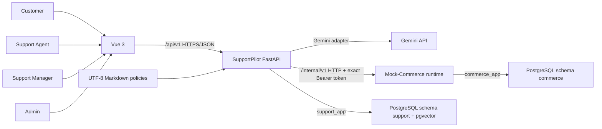
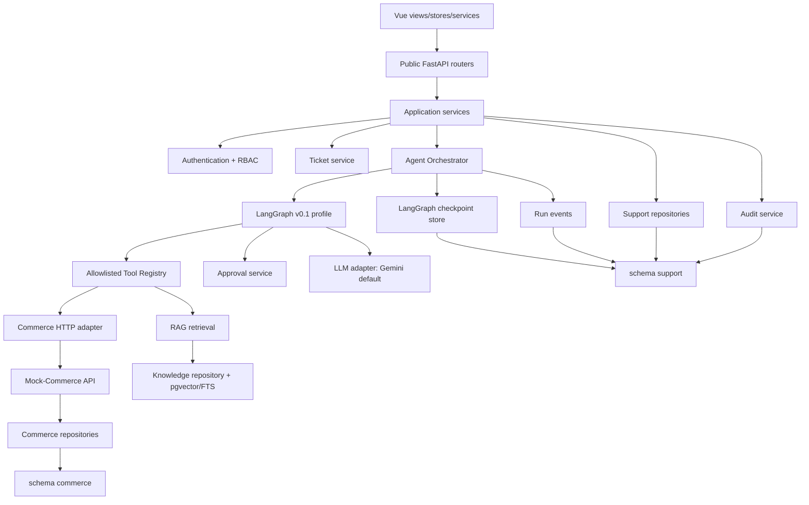
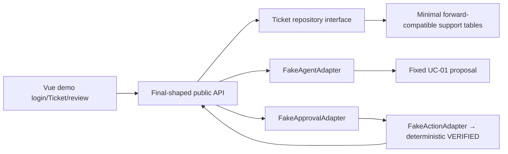
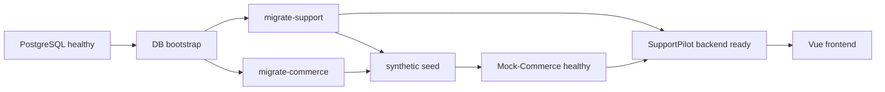

# SupportPilot — Architecture

> Trạng thái: tài liệu tổ chức kiến trúc dẫn xuất từ [PLAN.md](./PLAN.md). `PLAN.md` là nguồn quyết định ưu tiên.

## 1. Architectural goals

- Chứng minh UC-01 end-to-end bằng vertical slice nhỏ nhưng có boundary production-shaped.
- Tách policy knowledge khỏi transactional commerce data.
- Bảo đảm mọi business write có approval và verification.
- Giữ customer isolation, least privilege, idempotency và auditability.
- Cho phép thay Gemini, embedding hoặc Mock-Commerce bằng adapter mà không đổi domain/graph contract.
- Tạo demo sớm bằng Walking Skeleton nhưng không để fake path lọt vào release.

## 2. System context



Vue không gọi Gemini hoặc Mock-Commerce trực tiếp. SupportPilot không đọc `commerce` tables; Mock-Commerce không đọc `support` tables.
`INTERNAL_SERVICE_TOKEN` chỉ tồn tại trong backend/Mock-Commerce environment; nó không được build hoặc trả về Vue.

## 3. Component view



## 4. Modular monolith boundaries

SupportPilot là modular monolith trong `backend/apps/support_api`. Router chỉ validate/authenticate rồi gọi application service; repository chỉ persistence và không gọi service khác. Business rules nằm trong domain/policy services, không chỉ trong prompt hoặc UI.

Mock-Commerce là runtime riêng trong `backend/apps/mock_commerce_api`, có entrypoint, database session, models, repositories và services riêng. Hai runtime có thể dùng cùng repository/image nhưng không chia sẻ runtime boundary.

## 5. Frontend boundary

- Vue 3/Vite/TypeScript/Pinia/Vue Router.
- Chỉ gọi public `/api/v1` endpoints bằng typed client.
- Tạo Ticket trước, nhận `ticket_id`, rồi gọi create-run; không suy đoán create-ticket có side effect.
- Poll Ticket/run timeline trong v0.1; không SSE/WebSocket requirement.
- Enforce UX states (loading/empty/denied/error), nhưng authorization thật nằm backend.
- Không nhận checkpoint payload, chain-of-thought, raw secrets hoặc unmasked cross-customer data.
- Không nhận, lưu hoặc gửi `INTERNAL_SERVICE_TOKEN`; public client chỉ dùng user JWT với `/api/v1`.

## 6. FastAPI application boundary

- Auth/JWT/RBAC, customer scope và request validation.
- Ticket/message lifecycle và idempotency.
- Orchestration, approval, action authorization, timeline projection và audit hooks.
- Support database access chỉ qua `support_app` runtime connection.
- Commerce access chỉ qua typed HTTP adapter; adapter tự inject `Authorization: Bearer <INTERNAL_SERVICE_TOKEN>` từ environment.
- Không chứa commerce SQLAlchemy model/repository/session.

## 7. LangGraph orchestration boundary

LangGraph quản lý state, routing, interrupt/resume và failure path. Nó không được:

- Tự chọn customer ID, URL hoặc arbitrary tool.
- Override deterministic business rule.
- Trực tiếp thay đổi Ticket ngoài domain service.
- Dùng events/audit để reconstruct graph.
- Lưu hoặc expose chain-of-thought.

Active v0.1 profile được định nghĩa tại [AGENT_WORKFLOW.md](./AGENT_WORKFLOW.md). Full node catalog chỉ là target v1.0.

LLM runtime mặc định là Gemini qua adapter với `GEMINI_MODEL=gemini-3.6-flash`. Local embedding runtime dùng exact contract do [RAG_DESIGN.md](./RAG_DESIGN.md) sở hữu: `intfloat/multilingual-e5-small`, revision `c007d7ef6fd86656326059b28395a7a03a7c5846`, dimension 384 và `e5-prefix-v1`.

## 8. Tool Registry boundary

- Registry là allowlist duy nhất cho agent tools.
- Mỗi invocation áp schema validation, actor/customer scope, permission tier, deadline, retry policy, idempotency và audit.
- Internal credential không phải tool argument, AgentState hoặc output; wrapper redact header/token khỏi log, audit và tool-call summaries.
- V0.1 chỉ enable UC-01 reads, `search_policy` và approved `sync_payment_status` write.
- Arbitrary HTTP/SQL/filesystem/shell/code execution và dynamic tool registration bị cấm.

## 9. RAG boundary

RAG chỉ dùng cho policy/SOP knowledge. Order, payment và shipment state không đi qua RAG. Ingestion chỉ nhận Markdown; retrieval dùng exact E5 contract, pgvector + PostgreSQL FTS, metadata-first filters, RRF và calibrated evidence gates. Chi tiết tại [RAG_DESIGN.md](./RAG_DESIGN.md).

## 10. Mock-Commerce boundary

- Sở hữu `commerce` schema và transactional rules.
- Public với SupportPilot qua `/internal/v1` HTTP contracts và exact `Authorization: Bearer <INTERNAL_SERVICE_TOKEN>`.
- Authenticate trước body/customer/ownership validation: thiếu/malformed token trả `401 INTERNAL_UNAUTHENTICATED`; token sai hoặc user JWT trả `403 INTERNAL_FORBIDDEN`.
- Internal token bị từ chối trên `/api/v1`, không đi qua query/body/cookie và không xuất hiện trong frontend, LLM, logs, audit hoặc tool-call output.
- Tự enforce customer scope, expected version, idempotency, locks và approval reference cho write.
- Không import SupportPilot repository/domain/agent/database session.
- Không nhận `SUPPORT_DATABASE_URL`.

## 11. PostgreSQL ownership

Một PostgreSQL instance local có hai schema:

| Schema | Owner | Runtime role | Nội dung |
|---|---|---|---|
| `support` | `support_owner` | `support_app` | Identity, Ticket, workflow/checkpoint, evidence, approvals/actions, knowledge/pgvector, notifications, idempotency và audit. |
| `commerce` | `commerce_owner` | `commerce_app` | Customer/product/order/item/payment fixtures, commerce idempotency/audit và transaction state UC-01. |

Không có cross-schema FK, shared runtime role hoặc runtime superuser. Chi tiết tại [DATABASE_DESIGN.md](./DATABASE_DESIGN.md).

## 12. HTTP-only commerce access rule

```text
support_api service/tool
  → commerce_contracts request/response types
  → Commerce HTTP adapter
  → /internal/v1 Mock-Commerce API
  → commerce service/repository
  → schema commerce
```

Không có đường tắt in-process hoặc direct SQL, kể cả trong integration/E2E tests.

## 13. Import dependency rules

### 13.1 Allowed

| From | May depend on |
|---|---|
| `support_api` | `packages/common`, `packages/commerce_contracts`, framework/libs và support-owned modules. |
| `mock_commerce_api` | `packages/common`, `packages/commerce_contracts`, framework/libs và commerce-owned modules. |
| `commerce_contracts` | Versioned HTTP request/response/error types; không domain persistence. |
| `common` | Schema-neutral correlation/error primitives. |
| Vue | Generated/maintained public API types; không backend persistence modules. |

### 13.2 Forbidden

- `support_api` → Mock-Commerce models, repositories, services hoặc DB session.
- `mock_commerce_api` → SupportPilot models, repositories, domain services, agent hoặc DB session.
- Shared package → SQLAlchemy model, repository, DB engine/session hoặc mutable business service.
- Router → repository bypassing application/domain service for business transitions.
- Repository → another application service.

CI import-boundary tests enforce these rules.

## 14. Module dependency guide

| Module | Allowed inputs/dependencies | Forbidden coupling |
|---|---|---|
| Authentication | Core, support repository, audit | Agent, commerce repository |
| Ticket | Customer scope, support repository, orchestrator, audit | Direct commerce/LLM calls |
| Agent Orchestration | Ticket, tools, RAG, approval, checkpoint, audit | Direct commerce DB |
| Order Resolution | Customer-scoped HTTP ports, deterministic scorer | RAG for order lookup |
| Policy Engine | Typed evidence and versioned rules | Prompt-only eligibility |
| Approval/Action | RBAC, immutable proposal, HTTP ownership check, audit | LLM-selected approver/target |
| Knowledge/RAG | Support DB, local embedding adapter | Transactional commerce data |

## 15. Workflow persistence ownership

| Store | Source of truth | Không được dùng cho |
|---|---|---|
| LangGraph checkpoint | State tối thiểu để resume; keyed bằng `thread_id=agent_run.id` | Public API, UI timeline, CoT storage |
| `support.agent_runs` | Business/operational summary: status, node, versions, failure, latency, correlation | Full AgentState copy hoặc checkpoint replacement |
| `support.agent_run_events` | Append-only UI/debug/operational timeline | Resume/reconstruct graph |
| `support.audit_logs` | Append-only security/business audit | Workflow state hoặc graph reconstruction |

Orchestrator phải đồng bộ checkpoint và run summary trong một service transaction khi có thể; nếu không atomic, ghi reconciliation marker và reconcile deterministic trước success. Missing/mismatched checkpoint ở resumable run phải escalate/audit, không tạo run mới ngầm.

Endpoint replay thuộc `support.idempotency_records`; business write replay thuộc `commerce.idempotency_records`. Mỗi runtime ghi audit trong schema mình sở hữu. Các bảng lịch sử/immutable dùng grants append-only và không cascade-delete.

## 16. Walking Skeleton architecture



- Chỉ chạy với `WORKFLOW_PROFILE=walking_skeleton` trong local/test.
- Phase 1 chỉ tạo PostgreSQL bootstrap, roles/schemas/grants, hai Alembic infrastructures và optional empty baselines; không tạo domain enum/table/seed.
- `SKEL-001` ở Phase 2 sở hữu domain migration đầu tiên: chỉ minimal final-named `support.users`, `support.customers`, `support.support_tickets`, `support.ticket_messages` và enum/index tối thiểu.
- Skeleton chạy PostgreSQL thật; không SQLite/in-memory, temporary/throwaway schema, RAG, commerce, workflow hoặc approval tables.
- Không Gemini, embedding, RAG, full LangGraph, real commerce transaction, payment sync hoặc full proposal versioning.
- Fake adapters nằm sau final interfaces; router/UI không import fake implementation trực tiếp.
- Fake `VERIFIED` chỉ giữ state-machine contract, không phải release evidence.

## 17. Fake provider replacement path

1. `DB-001A`/`AUTH-001`/`TKT-001` mở rộng forward-only và thay minimal persistence/demo auth.
2. `MOCK-AUTH-001`, Mock-Commerce và Order Resolution thay fake evidence source bằng exact authenticated HTTP boundary.
3. `DB-001C`/`KB-001`/`KB-002`/`RAG-001` thêm Markdown/E5/RRF và synchronous atomic reindex, thay fixed policy evidence.
4. `DB-001B1/B2/B3` và checkpoint-backed v0.1 LangGraph thay `FakeAgentAdapter`.
5. `APR-001` + `ACT-001` thay fake approval/action happy path.
6. `APR-002` thêm reviewer edit/reapproval.
7. Full Vue review flow thay skeleton views nhưng giữ public contract.
8. Release CI chỉ chấp nhận `WORKFLOW_PROFILE=v0_1` và không fake path.

## 18. Runtime containers

| Container | Boundary/credential |
|---|---|
| `postgres` | PostgreSQL + vector/pg_trgm/unaccent/citext; admin init only. |
| `db-bootstrap` | One-shot `DB-000`; chỉ nhận `POSTGRES_BOOTSTRAP_DATABASE_URL` + bốn role-password secrets, tạo roles/schemas/grants rồi exit. |
| `migrate-support` | One-shot; chỉ nhận `SUPPORT_MIGRATION_DATABASE_URL` của `support_owner`. |
| `migrate-commerce` | One-shot; chỉ nhận `COMMERCE_MIGRATION_DATABASE_URL` của `commerce_owner`. |
| `seed` | One-shot synthetic `payment-mismatch-v01`. |
| `mock-commerce` | Port 8080 internal; chỉ `COMMERCE_DATABASE_URL` của `commerce_app` và `INTERNAL_SERVICE_TOKEN`. |
| `backend` | Port 8000; chỉ `SUPPORT_DATABASE_URL` của `support_app` và `INTERNAL_SERVICE_TOKEN`; synchronous agent runtime. |
| `frontend` | Port 5173 dev hoặc static build. |

Không Redis, queue, Mailpit, OTEL collector hoặc PDF worker trong default v0.1 stack.

## 19. Docker Compose startup order



Admin/owner DSNs không được inject vào runtime containers.

## 20. Deployment view

V0.1 là local Docker Compose trên một private network. Chỉ frontend/backend cần expose host ports; Mock-Commerce chỉ cần backend truy cập nội bộ. PostgreSQL dùng named volume. Cloud topology, Kubernetes và production HA không thuộc v0.1.

## 21. Failure boundaries

| Boundary | Hành vi |
|---|---|
| LLM malformed/timeout | Tối đa 2 attempts, 12 giây/attempt và global deadline; typed failure/escalation. |
| Read HTTP timeout/5xx | Bounded retry; không retry permission/business 4xx. |
| Write response unknown | Action `UNKNOWN`; status reconcile/verify với cùng key; không blind retry. |
| RAG no-answer/conflict | Không evidence claim; clarification/escalation. |
| Approval expired/rejected | Không execute; persist/audit; run/Ticket escalated. |
| Workflow deadline | Persist run `FAILED`, Ticket `ESCALATED`, audit rồi trả `504`. |
| Checkpoint invariant | Không reconstruct/tạo run ngầm; escalate và audit. |
| Audit/event failure | Không biến audit/events thành resume store; surface degraded state/alert per workflow contract. |

## 22. Scalability considerations after v0.1

Chỉ đánh giá sau khi có evidence:

- Durable queue/worker cho long-running/concurrent workload.
- SSE/WebSocket cho realtime UI.
- Reranker/Qdrant khi corpus/quality/latency chứng minh cần.
- Production database HA, backup/RPO/RTO, secret manager và centralized observability.

Các thay đổi này không được làm queue hoặc event log thành nguồn workflow state và cần ADR riêng.

## 23. ADR register

Các ADR sau cần được tạo để ghi lại quyết định đã duyệt, không phải để tự mở lại scope:

| ADR | Chủ đề | Trạng thái nguồn |
|---|---|---|
| ADR-001 | Modular monolith + separate Mock-Commerce runtime | Approved in PLAN §5/§20 |
| ADR-002 | HTTP-only commerce boundary và split DB roles | Approved in PLAN §5/§7/§20 |
| ADR-003 | Explicit synchronous Agent Run, no queue | Approved in PLAN §8/§20 |
| ADR-004 | Checkpoint/run/events/audit ownership | Approved in PLAN §7/§20 |
| ADR-005 | Gemini adapter và v0.1 graph profile | Approved in PLAN §9/§20 |
| ADR-006 | Local E5 + pgvector/FTS/RRF/gates | Approved in PLAN §12/§20 |
| ADR-007 | Approval/version/hash/verified-action invariant | Approved in PLAN §8–§10/§20 |
| ADR-008 | Walking Skeleton and fake replacement policy | Approved in PLAN §5/§21–§23 |

## Source and traceability

- Nguồn chính: [PLAN.md](./PLAN.md), §5–§6, §7.1/§7.8, §13, §16–§18, §20–§23.
- Tài liệu liên quan: [DATABASE_DESIGN.md](./DATABASE_DESIGN.md), [API_CONTRACT.md](./API_CONTRACT.md), [AGENT_WORKFLOW.md](./AGENT_WORKFLOW.md), [RAG_DESIGN.md](./RAG_DESIGN.md), [SECURITY.md](./SECURITY.md), [ROADMAP.md](./ROADMAP.md).
- Quyết định không được thay đổi: modular monolith; separate Mock-Commerce runtime; HTTP-only access; split schema/roles; checkpoint ownership; explicit synchronous trigger; no queue; provider/model; no CoT; Walking Skeleton không phải release path.
- Phiên bản nguồn: `PLAN.md` hiện không có version nội tại; traceability snapshot ngày 2026-08-04.
