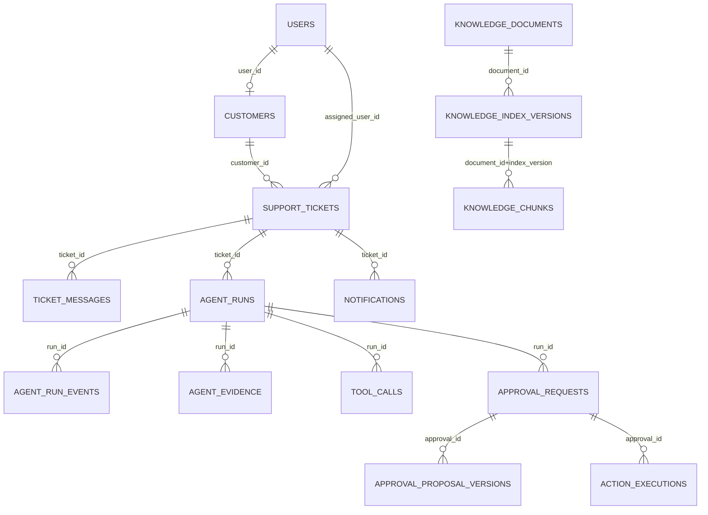
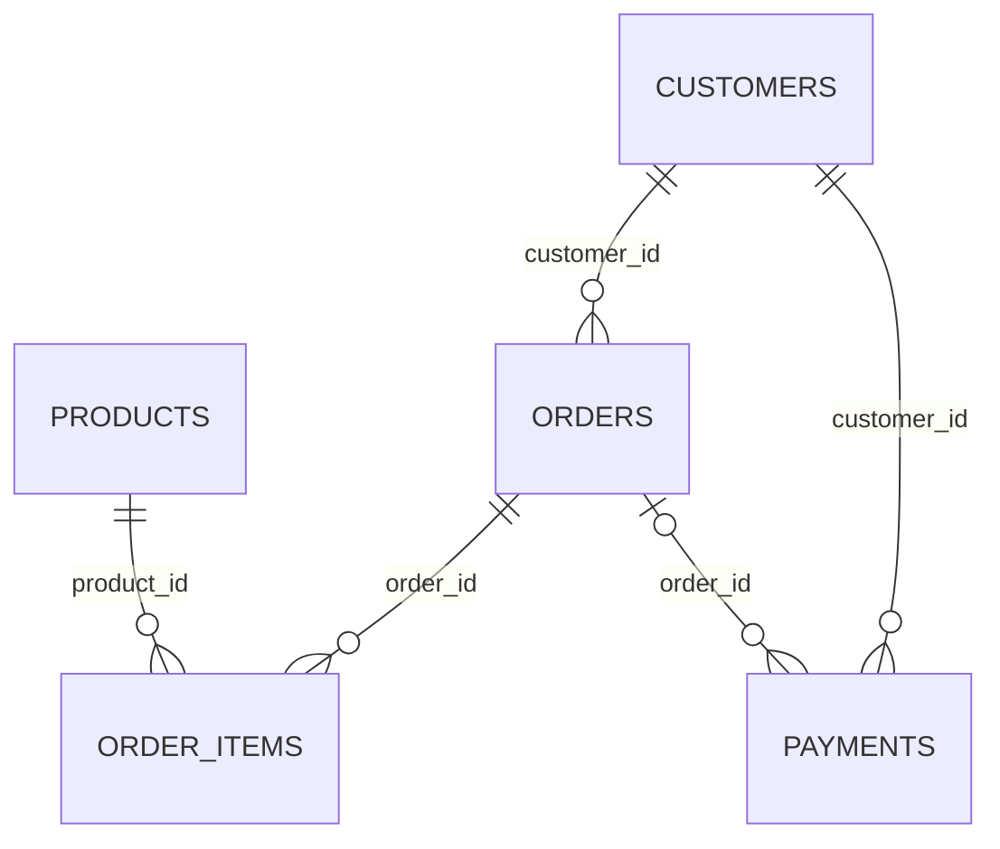

# SupportPilot — Database Design

> Trạng thái: normative physical database contract dẫn xuất từ [PLAN.md](./PLAN.md). Tài liệu này không phải migration và không tạo DDL.

## 1. Design principles

- Mọi application table dùng UUID primary key và UTC timestamps trừ khi checkpointer library quản lý physical schema riêng.
- JSONB chỉ chứa dữ liệu phụ đã redact; field cần constraint/query thường xuyên phải có cột riêng.
- V0.1 chỉ lưu synthetic local/demo data.
- Database enum/check chặn **status value** không hợp lệ; domain service/state machine chặn **transition** không hợp lệ.
- V0.1 không yêu cầu PostgreSQL transition trigger.
- Không có cross-schema FK, shared application role hoặc runtime superuser.
- PK mặc định `gen_random_uuid()`; timestamps dùng `TIMESTAMPTZ`/UTC/default `now()`; tiền `NUMERIC(18,2)`; currency uppercase `CHAR(3)`; optimistic version bắt đầu từ 1 và tăng đúng một mỗi successful write.
- Không `CASCADE` trong physical tables v0.1; lịch sử/audit/execution dùng `ON DELETE RESTRICT` hoặc cố ý không FK. Immutable/append-only tables bị revoke `UPDATE/DELETE`, không chỉ dựa vào convention.

## 2. PostgreSQL extensions

| Extension | Mục đích |
|---|---|
| `vector` | `vector(384)` và cosine retrieval. |
| `pg_trgm` | Fuzzy/trigram product matching cho Order Resolution. |
| `unaccent` | Accent-insensitive normalization/search khi phù hợp. |
| `citext` | Case-insensitive email uniqueness. |

Extension được bootstrap/migrate bởi privileged one-shot process, không bởi runtime role.

## 3. Schema ownership và roles

| Role | Quyền | Credential scope |
|---|---|---|
| Bootstrap admin | Tạo roles, schemas, grants/default privileges | Chỉ `db-bootstrap`; `POSTGRES_BOOTSTRAP_DATABASE_URL` |
| `support_owner` | Owner/migration cho `support` | Chỉ `migrate-support`; `SUPPORT_MIGRATION_DATABASE_URL` |
| `commerce_owner` | Owner/migration cho `commerce` | Chỉ `migrate-commerce`; `COMMERCE_MIGRATION_DATABASE_URL` |
| `support_app` | Runtime DML cần thiết trong `support`; zero access `commerce` | Chỉ backend; `SUPPORT_DATABASE_URL` |
| `commerce_app` | Runtime DML cần thiết trong `commerce`; zero access `support` | Chỉ Mock-Commerce; `COMMERCE_DATABASE_URL` |

Bootstrap nhận bốn role-password secrets, chạy idempotently rồi thoát. Admin/owner DSNs không được truyền vào runtime.

## 4. Bootstrap process

1. Chờ PostgreSQL healthy.
2. Dùng one-shot admin DSN tạo `support_owner`, `commerce_owner`, `support_app`, `commerce_app` nếu chưa có.
3. Tạo schemas và gán owner tương ứng.
4. Revoke cross-schema/default public privileges.
5. Grant runtime DML/sequence rights tối thiểu và owner migration rights.
6. Thiết lập default privileges cho object tương lai.
7. Chạy grant assertions: mỗi runtime role bị chặn schema còn lại.
8. Xóa admin credential khỏi downstream environment và exit.

## 5. Entity relationship overview

### 5.1 Schema `support`

LangGraph checkpoint tables liên kết logic bằng `thread_id=agent_run.id`; physical table names/columns do checkpointer version được pin quản lý và không được giả định bởi public repository code.

### 5.2 Schema `commerce`

Hai diagram không có relationship với nhau. `support.customers.commerce_customer_ref` là external reference được validate qua HTTP, không phải FK.

## 6. Support identity, Ticket và Message (`DB-001A`)

### 6.1 `support.users`

| Column | Type/constraint | Rule |
|---|---|---|
| `id` | UUID PRIMARY KEY DEFAULT `gen_random_uuid()` | Required |
| `email` | CITEXT NOT NULL UNIQUE | Plaintext synthetic only |
| `password_hash` | TEXT NOT NULL | Argon2; không plaintext password |
| `role` | `support.user_role` NOT NULL: `CUSTOMER/SUPPORT_AGENT/SUPPORT_MANAGER/ADMIN` | Valid-value constraint |
| `status` | `support.account_status` NOT NULL DEFAULT `ACTIVE`: `ACTIVE/DISABLED` | Valid-value constraint |
| `last_login_at` | TIMESTAMPTZ NULL | UTC |
| `created_at`, `updated_at` | TIMESTAMPTZ NOT NULL DEFAULT `now()` | UTC |

### 6.2 `support.customers`

| Column | Type/constraint | Rule |
|---|---|---|
| `id` | UUID PRIMARY KEY DEFAULT `gen_random_uuid()` | Required |
| `user_id` | UUID NOT NULL UNIQUE FK → `support.users.id ON DELETE RESTRICT` | Customer login mapping |
| `commerce_customer_ref` | VARCHAR(128) NOT NULL UNIQUE | External HTTP reference; no cross-schema FK |
| `email` | CITEXT NOT NULL | Plaintext synthetic only |
| `phone` | VARCHAR(32) NULL | Plaintext synthetic only |
| `verified_at` | TIMESTAMPTZ NULL | Identity verification |
| `status` | `support.account_status` NOT NULL DEFAULT `ACTIVE` | Valid-value constraint |
| `created_at`, `updated_at` | TIMESTAMPTZ NOT NULL DEFAULT `now()` | UTC |

### 6.3 `support.support_tickets`

| Column | Type/constraint |
|---|---|
| `id` | UUID PRIMARY KEY DEFAULT `gen_random_uuid()` |
| `ticket_number` | VARCHAR(32) NOT NULL UNIQUE |
| `customer_id` | UUID NOT NULL FK → `support.customers.id ON DELETE RESTRICT` |
| `source` | `support.ticket_source` NOT NULL: `WEB/API` |
| `subject` | TEXT NOT NULL; plaintext synthetic |
| `intent` | VARCHAR(64) NULL; nếu có trong v0.1 chỉ `payment_mismatch` |
| `priority` | `support.ticket_priority` NOT NULL DEFAULT `NORMAL`: `LOW/NORMAL/HIGH` |
| `status` | `support.ticket_status` NOT NULL DEFAULT `OPEN`; values tại §10 |
| `assigned_user_id` | UUID NULL FK → `support.users.id ON DELETE RESTRICT` |
| `lock_version` | INTEGER NOT NULL DEFAULT 1 CHECK `>= 1` |
| `created_at`, `updated_at` | TIMESTAMPTZ NOT NULL DEFAULT `now()` |
| `resolved_at`, `closed_at` | TIMESTAMPTZ NULL |

Indexes: `(customer_id, created_at DESC)`, `(status, updated_at DESC)`. `resolved_at` chỉ non-null khi status `RESOLVED/CLOSED`; `closed_at` chỉ non-null khi `CLOSED`.

### 6.4 `support.ticket_messages`

| Column | Type/constraint |
|---|---|
| `id` | UUID PRIMARY KEY DEFAULT `gen_random_uuid()` |
| `ticket_id` | UUID NOT NULL FK → `support.support_tickets.id ON DELETE RESTRICT` |
| `sender_type` | `support.message_sender_type` NOT NULL: `CUSTOMER/STAFF/SYSTEM` |
| `sender_user_id` | UUID NULL FK → `support.users.id ON DELETE RESTRICT` |
| `content` | TEXT NOT NULL; plaintext synthetic |
| `idempotency_key` | VARCHAR(128) NOT NULL |
| `created_at` | TIMESTAMPTZ NOT NULL DEFAULT `now()` |

Unique `(ticket_id, idempotency_key)`. Index: `(ticket_id, created_at, id)`.

V0.1 không tạo customer addresses, ticket attachments, cột attachment reference/JSON/blob/FK hoặc các cột `*_cipher`, `*_lookup_hash`, `content_cipher`. API reject non-empty `attachment_references` trước transaction ghi message; omitted/`[]` không tạo attachment data.

## 7. Workflow, approval, action và audit (`DB-001B1/B2/B3`)

Named enums vật lý:

- `support.agent_run_status`: `CREATED/RUNNING/WAITING_CUSTOMER/WAITING_APPROVAL/EXECUTING/VERIFYING/COMPLETED/ESCALATED/FAILED`.
- `support.tool_call_status`: `PENDING/RUNNING/SUCCEEDED/FAILED/TIMED_OUT`.
- `support.approval_status`: `PENDING/EDITED_PENDING_REAPPROVAL/APPROVED/REJECTED/EXPIRED/SUPERSEDED/CONSUMED/INVALIDATED`.
- `support.action_execution_status`: `PENDING/RUNNING/SUCCEEDED/VERIFYING/VERIFIED/FAILED_RETRYABLE/FAILED_FINAL/UNKNOWN`.
- `support.notification_status`: `DRAFT/DELIVERED/FAILED`; `support.audit_result`: `SUCCEEDED/DENIED/FAILED`.
- `support.evidence_kind`: `COMMERCE_API/POLICY_CHUNK/CUSTOMER_MESSAGE/DOMAIN_RULE`.
- `support.permission_tier`: `BACKEND_SCOPED/SAFE_READ/BUSINESS_WRITE/INTERNAL_WRITE`.
- `support.idempotency_scope`: `TICKET_CREATE/AGENT_RUN_CREATE/MESSAGE_CREATE/APPROVAL_DECISION/KNOWLEDGE_DOCUMENT_CREATE/KNOWLEDGE_PUBLISH/KNOWLEDGE_REINDEX`.

### 7.1 LangGraph checkpoint tables

- Physical schema do pinned LangGraph checkpointer quản lý.
- Key/thread identity: `thread_id = agent_run.id`.
- Lưu state tối thiểu cần resume; không lưu chain-of-thought.
- Không public API và không dùng làm timeline/audit.
- Schema do official PostgreSQL checkpointer migration quản lý trong `support`; không sửa tùy ý hoặc sao chép payload sang domain table.

### 7.2 `support.agent_runs`

| Column | PostgreSQL contract |
|---|---|
| `id` | UUID PK DEFAULT `gen_random_uuid()` |
| `ticket_id` | UUID NOT NULL FK `support.support_tickets(id) ON DELETE RESTRICT` |
| `idempotency_key` | VARCHAR(128) NOT NULL |
| `status` | `support.agent_run_status` NOT NULL DEFAULT `CREATED` |
| `current_node` | VARCHAR(128) NULL |
| `graph_version`, `prompt_version` | VARCHAR(64) NOT NULL |
| `llm_provider` | VARCHAR(32) NOT NULL |
| `llm_model` | VARCHAR(128) NOT NULL |
| `state_summary` | JSONB NOT NULL DEFAULT `'{}'`; safe projection, không raw message/secret/CoT/checkpoint copy |
| `failure_code` | VARCHAR(64) NULL |
| `correlation_id` | UUID NOT NULL |
| `input_tokens`, `output_tokens` | BIGINT NOT NULL DEFAULT 0 CHECK `>= 0` |
| `latency_ms` | BIGINT NULL CHECK `>= 0` |
| `lock_version` | INTEGER NOT NULL DEFAULT 1 CHECK `>= 1` |
| `started_at`, `completed_at` | TIMESTAMPTZ NULL |
| `created_at`, `updated_at` | TIMESTAMPTZ NOT NULL DEFAULT `now()` |

Constraints/indexes:

- Unique `(ticket_id, idempotency_key)`.
- Partial unique index `ux_agent_runs_one_nonterminal_ticket` trên `ticket_id`: tối đa một run/ticket có status `CREATED`, `RUNNING`, `WAITING_CUSTOMER`, `WAITING_APPROVAL`, `EXECUTING` hoặc `VERIFYING`.
- Indexes `(ticket_id,created_at DESC)`, `(status,updated_at)`, `(correlation_id)`. `completed_at` bắt buộc cho `COMPLETED/ESCALATED/FAILED` và NULL cho non-terminal; update dùng `lock_version`.

### 7.3 `support.agent_run_events`

- `id` UUID PK DEFAULT `gen_random_uuid()`; `run_id` UUID NOT NULL FK `agent_runs(id) ON DELETE RESTRICT`; `sequence` BIGINT NOT NULL CHECK `> 0`; `event_type` VARCHAR(64) NOT NULL; `summary` TEXT NULL; `payload` JSONB NOT NULL DEFAULT `'{}'`; `created_at` TIMESTAMPTZ NOT NULL DEFAULT `now()`.
- Unique `(run_id,sequence)`; indexes `(run_id,sequence)`, `(event_type,created_at DESC)`; append-only bằng grants, sequence cấp dưới row/advisory lock.
- Không dùng resume hoặc reconstruct graph.

### 7.4 `support.agent_evidence`

- `id` UUID PK DEFAULT `gen_random_uuid()`; `run_id` UUID NOT NULL FK `agent_runs(id) ON DELETE RESTRICT`; `kind support.evidence_kind` NOT NULL; `source_ref` VARCHAR(255) NOT NULL; `chunk_id` UUID NULL FK `knowledge_chunks(id) ON DELETE RESTRICT`; `score` DOUBLE PRECISION NULL CHECK `>= 0`; `rank` INTEGER NULL CHECK `> 0`; `summary` TEXT NOT NULL; `metadata` JSONB NOT NULL DEFAULT `'{}'`; `created_at` TIMESTAMPTZ NOT NULL DEFAULT `now()`.
- Indexes `(run_id,kind,created_at)` và partial `(chunk_id) WHERE chunk_id IS NOT NULL`; append-only. CHECK `kind='POLICY_CHUNK'` iff `chunk_id IS NOT NULL`.

### 7.5 `support.tool_calls`

- `id` UUID PK DEFAULT `gen_random_uuid()`; `run_id` UUID NOT NULL FK `agent_runs(id) ON DELETE RESTRICT`; `call_group_id` UUID NOT NULL; `tool_name/tool_version` VARCHAR(64) NOT NULL; `permission_tier support.permission_tier` NOT NULL; `status support.tool_call_status` NOT NULL DEFAULT `PENDING`; `attempt` SMALLINT NOT NULL DEFAULT 1 CHECK `> 0`.
- `input_summary` JSONB NOT NULL DEFAULT `'{}'`; `output_summary` JSONB NULL; `error_code` VARCHAR(64) NULL; `latency_ms` BIGINT NULL CHECK `>= 0`; `idempotency_key` VARCHAR(128) NULL; `actor_user_id` UUID NULL FK `users(id) ON DELETE RESTRICT`; `customer_id` UUID NULL FK `customers(id) ON DELETE RESTRICT`; `lock_version` INTEGER NOT NULL DEFAULT 1 CHECK `>=1`; `started_at/completed_at` TIMESTAMPTZ NULL; `created_at/updated_at` TIMESTAMPTZ NOT NULL DEFAULT `now()`.
- Unique `(run_id,call_group_id,attempt)`; indexes `(run_id,created_at)`, `(tool_name,status,created_at)`, partial `(idempotency_key) WHERE ... IS NOT NULL`. `BUSINESS_WRITE` bắt buộc actor/customer/key. Mỗi retry tạo attempt mới; terminal attempt trở thành immutable.

### 7.6 `support.approval_requests`

| Column | PostgreSQL contract |
|---|---|
| `id` | UUID PK DEFAULT `gen_random_uuid()` |
| `run_id` | UUID NOT NULL FK `agent_runs(id) ON DELETE RESTRICT` |
| `action_type` | VARCHAR(64) NOT NULL |
| `target_ref` | VARCHAR(255) NOT NULL |
| `required_role` | `support.user_role` NOT NULL CHECK `<> 'CUSTOMER'` |
| `status` | `support.approval_status` NOT NULL DEFAULT `PENDING` |
| `current_version` | INTEGER NOT NULL DEFAULT 1 CHECK `>= 1` |
| `current_proposal_hash` | VARCHAR(71) NOT NULL CHECK `^sha256:[0-9a-f]{64}$` |
| `decided_by` | UUID NULL FK `users(id) ON DELETE RESTRICT` |
| `decision` | VARCHAR(16) NULL CHECK `IN ('APPROVE','EDIT','REJECT')` |
| `decision_reason` | TEXT NULL, redacted |
| `requested_at` | TIMESTAMPTZ NOT NULL DEFAULT `now()` |
| `expires_at` | TIMESTAMPTZ NOT NULL CHECK `expires_at > requested_at` |
| `decided_at` | TIMESTAMPTZ NULL |
| `lock_version` | INTEGER NOT NULL DEFAULT 1 CHECK `>= 1` |
| `created_at`, `updated_at` | TIMESTAMPTZ NOT NULL DEFAULT `now()` |

Indexes `(run_id,created_at DESC)`, `(required_role,status,expires_at)`, partial `(expires_at) WHERE status IN ('PENDING','EDITED_PENDING_REAPPROVAL')`. Composite FK `(id,current_version,current_proposal_hash)` tới proposal version là `ON DELETE RESTRICT DEFERRABLE INITIALLY DEFERRED`. Decision dùng row lock + expected version/hash/lock version. Pending fields phải null; approved/consumed cần APPROVE+actor/time; rejected cần REJECT+actor/time; expired/superseded/invalidated có decision null và terminal timestamp. Lazy expiry phải persist `EXPIRED`.

### 7.7 `support.approval_proposal_versions`

- `id` UUID PK DEFAULT `gen_random_uuid()`; `approval_id` UUID NOT NULL FK `approval_requests(id) ON DELETE RESTRICT`; `version` INTEGER NOT NULL CHECK `>=1`; `proposal` JSONB NOT NULL; `proposal_hash` VARCHAR(71) NOT NULL CHECK `^sha256:[0-9a-f]{64}$`; `material_change` BOOLEAN NOT NULL DEFAULT false; `edited_by` UUID NULL FK `users(id) ON DELETE RESTRICT`; `created_at` TIMESTAMPTZ NOT NULL DEFAULT `now()`.
- Unique `(approval_id,version)`, `(approval_id,proposal_hash)`, `(approval_id,version,proposal_hash)`; append-only bằng grants. `material_change=true` bắt buộc `edited_by`; proposal chỉ chứa allowlisted action schema và expected target version.

### 7.8 `support.action_executions`

- `id` UUID PK DEFAULT `gen_random_uuid()`; `approval_id` UUID NOT NULL UNIQUE FK `approval_requests(id) ON DELETE RESTRICT`; `proposal_version` INTEGER NOT NULL và `proposal_hash` VARCHAR(71) NOT NULL với composite FK tới proposal version; `action_type` VARCHAR(64) NOT NULL (v0.1 chỉ `sync_payment_status`); `target_ref` VARCHAR(255) NOT NULL; `idempotency_key` VARCHAR(128) NOT NULL UNIQUE.
- `status support.action_execution_status` NOT NULL DEFAULT `PENDING`; `expected_target_version` INTEGER NOT NULL CHECK `>=1`; `request_payload` JSONB NOT NULL DEFAULT `'{}'`; `result_payload` JSONB NULL; `error_code` VARCHAR(64) NULL; `lock_version` INTEGER NOT NULL DEFAULT 1 CHECK `>=1`; `started_at/completed_at/verified_at` TIMESTAMPTZ NULL; `created_at/updated_at` TIMESTAMPTZ NOT NULL DEFAULT `now()`.
- Indexes `(status,updated_at)`, `(target_ref,created_at DESC)`. `VERIFIED` bắt buộc `verified_at`, status khác cấm `verified_at`; `UNKNOWN` không phải complete/success và không blind retry.

### 7.9 `support.notifications`

- `id` UUID PK DEFAULT `gen_random_uuid()`; `ticket_id` UUID NOT NULL FK `support_tickets(id) ON DELETE RESTRICT`; `run_id` UUID NULL FK `agent_runs(id) ON DELETE RESTRICT`; `recipient_type` VARCHAR(16) NOT NULL CHECK `(recipient_type IN ('CUSTOMER','STAFF'))`; `recipient_ref` VARCHAR(255) NOT NULL; `channel` VARCHAR(16) NOT NULL CHECK `(channel IN ('DRAFT_ONLY','INTERNAL'))`; `draft_body` TEXT NOT NULL; `status support.notification_status` NOT NULL DEFAULT `DRAFT`; `idempotency_key` VARCHAR(128) NOT NULL UNIQUE; `lock_version` INTEGER NOT NULL DEFAULT 1 CHECK `>=1`; `created_at/updated_at` TIMESTAMPTZ NOT NULL DEFAULT `now()`.
- Indexes `(ticket_id,created_at DESC)`, `(status,created_at)`. Recipient `CUSTOMER` bắt buộc channel `DRAFT_ONLY`; không SMTP/customer send timestamp.

### 7.10 `support.audit_logs`

- `id` UUID PK DEFAULT `gen_random_uuid()`; `correlation_id` UUID NOT NULL; `actor_type` VARCHAR(16) NOT NULL CHECK `(actor_type IN ('USER','SERVICE','SYSTEM'))`; `actor_id` UUID NULL không FK; `action` VARCHAR(128) NOT NULL; `resource_type` VARCHAR(64) NOT NULL; `resource_id` UUID NULL không FK; `result support.audit_result` NOT NULL; `before_hash/after_hash` VARCHAR(71) NULL; `details` JSONB NOT NULL DEFAULT `'{}'`; `created_at` TIMESTAMPTZ NOT NULL DEFAULT `now()`.
- Indexes `(created_at DESC)`, `(correlation_id)`, `(actor_type,actor_id,created_at DESC)`, `(resource_type,resource_id,created_at DESC)`, `(action,result,created_at DESC)`. Append-only bằng grants; không update/delete/cascade và không dùng resume/reconstruct.

### 7.11 `support.idempotency_records`

| Column | PostgreSQL contract |
|---|---|
| `id` | UUID PK DEFAULT `gen_random_uuid()` |
| `scope` | `support.idempotency_scope` NOT NULL |
| `principal_fingerprint` | CHAR(64) NOT NULL; SHA-256 scoped principal, không raw token |
| `idempotency_key` | VARCHAR(128) NOT NULL |
| `request_hash` | CHAR(64) NOT NULL |
| `response_status` | SMALLINT NOT NULL CHECK `BETWEEN 100 AND 599` |
| `response_body` | JSONB NOT NULL; exact redacted response envelope |
| `resource_type` | VARCHAR(64) NOT NULL |
| `resource_id` | UUID NULL, không FK |
| `created_at` | TIMESTAMPTZ NOT NULL DEFAULT `now()` |
| `expires_at` | TIMESTAMPTZ NULL CHECK `> created_at` |

Unique `(scope,principal_fingerprint,idempotency_key)`; partial index `(expires_at) WHERE expires_at IS NOT NULL`; immutable. Same key + same request hash replay exact status/body; khác hash trả conflict và không thực thi.

## 8. Knowledge và embedding provenance (`DB-001C`)

Named enums: `support.knowledge_document_status = DRAFT/VALIDATED/PUBLISHED/SUPERSEDED/EXPIRED`; `support.knowledge_index_status = BUILDING/COMPLETED/FAILED`.

### 8.1 `support.knowledge_documents`

| Column | PostgreSQL contract |
|---|---|
| `id` | UUID PK DEFAULT `gen_random_uuid()` |
| `title` | VARCHAR(255) NOT NULL |
| `policy_type` | VARCHAR(64) NOT NULL |
| `version` | VARCHAR(64) NOT NULL |
| `region`, `language` | VARCHAR(16) NOT NULL |
| `product_category` | VARCHAR(64) NOT NULL DEFAULT `all` |
| `effective_from` | TIMESTAMPTZ NOT NULL |
| `effective_to` | TIMESTAMPTZ NULL CHECK `> effective_from` |
| `status` | `support.knowledge_document_status` NOT NULL DEFAULT `DRAFT` |
| `source_uri` | TEXT NOT NULL |
| `checksum` | CHAR(64) NOT NULL |
| `active_index_version` | VARCHAR(64) NULL; chỉ completed index của chính document |
| `lock_version` | INTEGER NOT NULL DEFAULT 1 CHECK `>=1` |
| `created_at`, `updated_at` | TIMESTAMPTZ NOT NULL DEFAULT `now()` |

Unique `(policy_type,region,language,product_category,version)`. Composite FK `(id,active_index_version)` tới `knowledge_index_versions(document_id,index_version) ON DELETE RESTRICT DEFERRABLE INITIALLY DEFERRED`; indexes active retrieval `(status,policy_type,region,language,product_category,effective_from,effective_to)` và checksum.

### 8.2 `support.knowledge_index_versions`

| Column | PostgreSQL contract |
|---|---|
| `id` | UUID PK DEFAULT `gen_random_uuid()` |
| `document_id` | UUID NOT NULL FK `knowledge_documents(id) ON DELETE RESTRICT` |
| `index_version` | VARCHAR(64) NOT NULL |
| `status` | `support.knowledge_index_status` NOT NULL DEFAULT `BUILDING` |
| `embedding_provider` | VARCHAR(64) NOT NULL |
| `embedding_model` | VARCHAR(255) NOT NULL |
| `embedding_revision` | VARCHAR(64) NOT NULL |
| `embedding_dimension` | INTEGER NOT NULL CHECK `= 384` |
| `embedding_input_format_version` | VARCHAR(64) NOT NULL |
| `chunk_count` | INTEGER NOT NULL DEFAULT 0 CHECK `>=0` |
| `calibration_required` | BOOLEAN NOT NULL DEFAULT true |
| `error_code` | VARCHAR(64) NULL |
| `lock_version` | INTEGER NOT NULL DEFAULT 1 CHECK `>=1` |
| `started_at` | TIMESTAMPTZ NOT NULL DEFAULT `now()` |
| `completed_at` | TIMESTAMPTZ NULL |
| `created_at`, `updated_at` | TIMESTAMPTZ NOT NULL DEFAULT `now()` |

Unique `(document_id,index_version)`; indexes `(document_id,status,created_at DESC)`, `(status,created_at)`. `COMPLETED/FAILED` cần `completed_at`; chỉ `FAILED` có `error_code`. BUILDING→terminal dùng lock version; provenance/status immutable sau terminal.

### 8.3 `support.knowledge_chunks`

- `id` UUID PK DEFAULT `gen_random_uuid()`; `document_id` UUID và `index_version` VARCHAR(64) NOT NULL với composite FK tới `knowledge_index_versions(document_id,index_version) ON DELETE RESTRICT`.
- `chunk_index` INTEGER NOT NULL CHECK `>=0`; `heading_path/content` TEXT NOT NULL; `embedding vector(384)` NOT NULL; `search_vector` TSVECTOR NOT NULL; `checksum` CHAR(64) NOT NULL; `metadata` JSONB NOT NULL DEFAULT `'{}'`.
- `embedding_provider/model/revision` VARCHAR(64)/VARCHAR(255)/VARCHAR(64) NOT NULL; `embedding_dimension` INTEGER NOT NULL CHECK `=384`; `embedding_input_format_version` VARCHAR(64) NOT NULL; `created_at` TIMESTAMPTZ NOT NULL DEFAULT `now()`.
- Unique `(document_id,index_version,chunk_index)`; B-tree `(document_id,index_version)`; GIN `search_vector`; no ANN index trong corpus v0.1. Chunk rows immutable và provenance phải khớp parent index.

Provider/model/revision/dimension/input-format hoặc retrieval-scoring change tạo index version mới, giữ active version cũ đến khi mọi chunks validate rồi atomic swap. Failure persist `FAILED` nhưng không đổi active pointer. Config change đặt `calibration_required=true` và effective `RAG_THRESHOLD_CALIBRATED=false`.

## 9. Commerce schema cho UC-01 (`DB-002A`)

Named enums: `commerce.customer_status = ACTIVE/DISABLED`; `commerce.product_status = ACTIVE/INACTIVE`; `commerce.order_status = PENDING_CONFIRMATION/CONFIRMED`; `commerce.order_payment_status = PENDING/PAID`; `commerce.payment_status = PENDING/SUCCEEDED/FAILED/REVERSED`; `commerce.write_result = SUCCEEDED/DENIED/FAILED`.

### 9.1 `commerce.customers`

- `id` UUID PK DEFAULT `gen_random_uuid()`; `external_ref` VARCHAR(128) NOT NULL UNIQUE; `email` CITEXT NOT NULL UNIQUE; `status commerce.customer_status` NOT NULL DEFAULT `ACTIVE`; `is_synthetic` BOOLEAN NOT NULL DEFAULT true CHECK `(is_synthetic)`; created/updated TIMESTAMPTZ NOT NULL DEFAULT `now()`.
- Index `(status,created_at DESC)`. Không FK sang `support.customers`; chỉ Mock-Commerce repository truy cập.

### 9.2 `commerce.products`

- `id` UUID PK DEFAULT `gen_random_uuid()`; `sku` VARCHAR(64) NOT NULL UNIQUE; `name` VARCHAR(255) NOT NULL; `normalized_name` TEXT NOT NULL; `category` VARCHAR(64) NOT NULL; `status commerce.product_status` NOT NULL DEFAULT `ACTIVE`; `is_synthetic` BOOLEAN NOT NULL DEFAULT true CHECK `(is_synthetic)`; created/updated TIMESTAMPTZ NOT NULL DEFAULT `now()`.
- Indexes `(category,status)` và GIN trigram `normalized_name`; normalization dùng fixed Unicode/case/accent fixtures.

### 9.3 `commerce.orders`

- `id` UUID PK DEFAULT `gen_random_uuid()`; `customer_id` UUID NOT NULL FK `customers(id) ON DELETE RESTRICT`; `order_number` VARCHAR(64) NOT NULL UNIQUE; `status commerce.order_status` NOT NULL DEFAULT `PENDING_CONFIRMATION`; `payment_status commerce.order_payment_status` NOT NULL DEFAULT `PENDING`.
- `total_amount` NUMERIC(18,2) NOT NULL CHECK `>=0`; `currency` CHAR(3) NOT NULL CHECK `(currency ~ '^[A-Z]{3}$')`; `version` INTEGER NOT NULL DEFAULT 1 CHECK `>=1`; `is_synthetic` BOOLEAN NOT NULL DEFAULT true CHECK `(is_synthetic)`; created/updated TIMESTAMPTZ NOT NULL DEFAULT `now()`.
- Unique `(id,customer_id)`; customer-scoped indexes `(customer_id,created_at DESC)`, `(customer_id,status,created_at DESC)`, `(customer_id,payment_status,created_at DESC)`. Write dùng expected version, tăng đúng một; zero-row phân biệt `STALE_ORDER` với scoped not-found.

### 9.4 `commerce.order_items`

- `id` UUID PK DEFAULT `gen_random_uuid()`; `order_id` UUID NOT NULL FK `orders(id) ON DELETE RESTRICT`; `product_id` UUID NOT NULL FK `products(id) ON DELETE RESTRICT`; `variant` VARCHAR(128) NULL; `quantity` INTEGER NOT NULL CHECK `>0`; `unit_amount` NUMERIC(18,2) NOT NULL CHECK `>=0`; `currency` CHAR(3) NOT NULL CHECK `(currency ~ '^[A-Z]{3}$')`; `is_synthetic` BOOLEAN NOT NULL DEFAULT true CHECK `(is_synthetic)`; created/updated TIMESTAMPTZ NOT NULL DEFAULT `now()`.
- Indexes `(order_id,id)`, `(product_id)`. Service kiểm tra currency/tổng amount trước commit, không trigger cộng tổng.

### 9.5 `commerce.payments`

- `id` UUID PK DEFAULT `gen_random_uuid()`; `customer_id` UUID NOT NULL FK `customers(id) ON DELETE RESTRICT`; `order_id` UUID NULL; `transaction_ref` VARCHAR(128) NULL; `status commerce.payment_status` NOT NULL; `amount` NUMERIC(18,2) NOT NULL CHECK `>0`; `currency` CHAR(3) NOT NULL CHECK `(currency ~ '^[A-Z]{3}$')`; `payment_method` VARCHAR(32) NOT NULL; `paid_at` TIMESTAMPTZ NULL; `version` INTEGER NOT NULL DEFAULT 1 CHECK `>=1`; `is_synthetic` BOOLEAN NOT NULL DEFAULT true CHECK `(is_synthetic)`; created/updated TIMESTAMPTZ NOT NULL DEFAULT `now()`.
- Composite FK `(order_id,customer_id) → orders(id,customer_id) ON DELETE RESTRICT`; unique partial transaction reference khi non-null; indexes `(customer_id,paid_at DESC)`, `(customer_id,status,amount,currency,paid_at DESC)`, partial `(order_id) WHERE order_id IS NOT NULL`. `SUCCEEDED` bắt buộc `paid_at`; modified payment tăng version đúng một. Không PAN/CVV/provider secret.

### 9.6 `commerce.idempotency_records`

- `id` UUID PK DEFAULT `gen_random_uuid()`; `operation` VARCHAR(64) NOT NULL CHECK `='SYNC_PAYMENT_STATUS'`; `idempotency_key` VARCHAR(128) NOT NULL; `request_hash` CHAR(64) NOT NULL; `order_id` UUID NOT NULL FK `orders(id) ON DELETE RESTRICT`; `response_status` SMALLINT NOT NULL CHECK `BETWEEN 100 AND 599`; `response_body` JSONB NOT NULL; `created_at` TIMESTAMPTZ NOT NULL DEFAULT `now()`.
- Unique `(operation,idempotency_key)`; index `(order_id,created_at DESC)`; immutable. Same key/hash replay; same key/different hash conflict.

### 9.7 `commerce.audit_logs`

- `id` UUID PK DEFAULT `gen_random_uuid()`; `correlation_id` UUID NOT NULL; `action` VARCHAR(64) NOT NULL CHECK `='SYNC_PAYMENT_STATUS'`; `order_id` UUID NOT NULL không FK; `result commerce.write_result` NOT NULL; `before_hash/after_hash` VARCHAR(71) NULL; `details` JSONB NOT NULL DEFAULT `'{}'`; `created_at` TIMESTAMPTZ NOT NULL DEFAULT `now()`.
- Indexes `(correlation_id)`, `(order_id,created_at DESC)`, `(action,result,created_at DESC)`; append-only bằng grants và không chứa bearer token/raw payload.

Shipping, refund, fulfillment claim, address change và warranty tables không thuộc v0.1.

Mọi FK đều trong schema `commerce` và `ON DELETE RESTRICT`; không cross-schema FK. Chỉ `orders`/`payments` có optimistic `version` vì customers/products/order_items là seed-owned immutable trong UC-01.

## 10. Status definitions và transition ownership

### 10.1 Ticket values

`OPEN`, `PROCESSING`, `WAITING_CUSTOMER`, `WAITING_APPROVAL`, `ESCALATED`, `RESOLVED`, `CLOSED`.

### 10.2 Agent Run values

`CREATED`, `RUNNING`, `WAITING_CUSTOMER`, `WAITING_APPROVAL`, `EXECUTING`, `VERIFYING`, `COMPLETED`, `ESCALATED`, `FAILED`. Không có `CANCELLED` trong v0.1.

### 10.3 Approval values

`PENDING`, `EDITED_PENDING_REAPPROVAL`, `APPROVED`, `REJECTED`, `EXPIRED`, `SUPERSEDED`, `CONSUMED`, `INVALIDATED`.

### 10.4 Action Execution values

`PENDING`, `RUNNING`, `SUCCEEDED`, `VERIFYING`, `VERIFIED`, `FAILED_RETRYABLE`, `FAILED_FINAL`, `UNKNOWN`.

Domain invariant bắt buộc: Ticket chỉ được `RESOLVED` sau khi approved business Action Execution đã `VERIFIED`; `UNKNOWN`, `SUCCEEDED` chưa verify hoặc failure không cho phép transition này.

Database enum/check chỉ bảo đảm value thuộc danh sách và structural invariant. Exact allowed transitions nằm tại [AGENT_WORKFLOW.md](./AGENT_WORKFLOW.md#11-state-machines); domain service kiểm tra transition và automated tests chứng minh. Không có PostgreSQL trigger mặc định.

## 11. Checkpoint ownership và reconciliation

> Checkpoint là source of truth cho graph resume. `agent_runs` là source of truth cho run business/operational status. `agent_run_events` là source of truth cho timeline. `audit_logs` là source of truth cho audit.

- Checkpoint payload không public và không chứa CoT.
- `agent_runs.state_summary` chỉ là safe projection.
- State-changing operation persist checkpoint + run status trong cùng service transaction nếu checkpointer hỗ trợ.
- Nếu không atomic, ghi reconciliation marker và reconcile deterministic trước success.
- Checkpoint tồn tại nhưng run không resumable: không resume; escalate Ticket chưa terminal và audit `agent_run.checkpoint_invariant_failed`.
- Run `WAITING_CUSTOMER/WAITING_APPROVAL` thiếu checkpoint: không tạo run mới ngầm; escalate run/Ticket và audit.
- Không reconstruct checkpoint từ events/audit.

## 12. Transaction boundaries

- Ticket + first message: một SupportPilot transaction.
- Agent-run creation: lock/check Ticket; partial unique index là final concurrency guard.
- Message: commit trước resume; resume timeout không rollback message.
- Approval decision: row lock, expiry + expected version/hash check và decision trong cùng transaction.
- Action authorization/execution record: lock approval trong SupportPilot transaction.
- Commerce sync: Mock-Commerce transaction riêng, lock order/payment, expected version và idempotency record.
- Knowledge publish/index swap/supersede: atomic transaction.
- Non-empty message attachment references bị reject trước message/idempotency-success/resume transaction.
- Không giữ database lock qua LLM hoặc remote HTTP call.

## 13. Locking strategy

| Operation | Lock/concurrency rule |
|---|---|
| Create Agent Run | Lock/check Ticket + partial unique active-run index. |
| Approval decision | `SELECT ... FOR UPDATE`; expected version/hash; one winner. |
| Execute action | Lock approval/authorization; unique execution key. |
| Commerce sync | Mock-Commerce locks target rows and checks expected version. |
| Knowledge publish | Transactional version/index swap. |

## 14. Idempotency storage

- Ticket/create-run/message/approval decision/knowledge create/publish/reindex responses được persist/replay trong `support.idempotency_records` với exact scopes đã liệt kê tại §7.
- Agent Run: unique `(ticket_id, idempotency_key)`.
- Message: unique `(ticket_id, idempotency_key)` khi non-null.
- Action Execution: unique action idempotency key; HTTP retry dùng lại key.
- Commerce write lưu idempotency result trong cùng transaction với state change.
- Cùng scoped principal+operation+key và cùng request hash trả stored status/body; khác request hash trả conflict; không chạy workflow/action lần hai.

## 15. Approval proposal versioning

- Proposal snapshot immutable, canonicalized và hashed.
- Decision gửi `expected_version` + `expected_proposal_hash`.
- Material edit (target, amount, currency, action type) tạo version/hash mới, reset TTL 24 giờ và yêu cầu reapproval.
- Non-material edit có thể approve trong cùng request và không kéo dài TTL hiện tại.
- Expired proposal không revive.

## 16. Knowledge versioning

- Document version/scope unique và có effective range/status uppercase named enum.
- Publish chỉ sau validation/indexing; version cũ chuyển `SUPERSEDED`, không hard delete.
- `EXPIRED/SUPERSEDED` document không vào active retrieval nhưng giữ historical audit.
- Synchronous reindex tạo `BUILDING` index version mới, validate full chunks/provenance/count, chuyển `COMPLETED` rồi atomic swap; không tự publish. Failure chuyển attempt `FAILED`, giữ active pointer cũ.

## 17. Sensitive data handling

- V0.1 dùng plaintext `email`, `phone`, `subject`, `content` chỉ cho synthetic data.
- Password luôn Argon2 hash.
- Không tạo fake `*_cipher/hash` columns.
- Không PAN/CVV/provider secret trong database/log/tool result.
- JSON/payload/state summary/tool input-output/audit details phải redact.
- V1.0 encryption migration là add → backfill → dual-read/write → verify → stop plaintext read → drop, qua nhiều migration.

## 18. Migration strategy

- Alembic migration tách `support` và `commerce`, chạy bằng owner tương ứng.
- Phase 1 (`DB-000`/`INF-001`) chỉ tạo roles/schemas/grants, hai Alembic configs/commands/versions directories và optional empty baselines; catalog không được có domain enum/table/seed.
- Phase 2 `SKEL-001` sở hữu domain migration đầu tiên, chỉ final-named minimal `support.users/customers/support_tickets/ticket_messages` trên PostgreSQL thật.
- Runtime app không tự migrate.
- Mỗi migration forward-reviewable; enum change tránh gộp với unrelated schema work.
- Không cross-schema FK hoặc dependency.
- Checkpointer schema version phải pin với LangGraph/checkpointer version.

## 19. Seed strategy

Seed profile `payment-mismatch-v01` dùng fixed IDs/checksums và chạy lại không duplicate. Tối thiểu có:

- verified customer, Support Agent và Manager;
- pending “ghế” order + succeeded payment;
- ambiguity order và same-looking order của customer khác;
- active, expired và conflicting policy fixtures;
- timeout, stale, duplicate retry, expired/material edit và `UNKNOWN` fixtures;
- versioned 25-case golden dataset.

Không seed dữ liệu khách thật.

## 20. Walking Skeleton migration policy

- `SKEL-001` là domain migration owner đầu tiên; chỉ tạo minimal final-named identity/Ticket/message columns và enum/index cần persist demo.
- Không SQLite/in-memory, bảng tạm, throwaway schema, RAG, payment, workflow, approval hoặc full schema.
- `DB-001A` mở rộng forward-only, backfill synthetic fixture rồi thêm final FK/NOT NULL/index.
- Không drop/recreate skeleton data để thay implementation.
- Fake action `VERIFIED` chỉ là adapter result trong skeleton profile, không phải production commerce evidence.

## 21. Backup/recovery assumptions cho local demo

- PostgreSQL named volume là local persistence, không phải production backup.
- Synthetic data có thể dựng lại từ bootstrap, migrations và idempotent seed.
- Không có production RPO/RTO hoặc point-in-time recovery requirement trong v0.1.
- Recovery phải chạy checkpoint/run reconciliation trước khi resume workflow.
- Mất checkpoint của waiting run không được khôi phục từ events/audit; run/Ticket phải escalate/audit.

## 22. Constraints và indexes checklist

- [ ] PK UUID và UTC timestamps theo contract.
- [ ] FK chỉ trong cùng schema.
- [ ] Unique email/customer mappings/Ticket/order number, partial transaction reference và scoped idempotency keys.
- [ ] Partial unique active-run index đúng sáu non-terminal statuses.
- [ ] Proposal version/hash và event sequence unique.
- [ ] Action key unique; `UNKNOWN` được hỗ trợ.
- [ ] Knowledge scope/version, index-version provenance, completed-only active pointer và chunk/index version unique.
- [ ] Workflow/commerce audit và immutable histories bị revoke update/delete; mọi FK history là RESTRICT/no-FK, không cascade.
- [ ] Ticket/message/retrieval indexes theo PLAN.
- [ ] Runtime grant tests chặn schema còn lại.
- [ ] Domain transition tests, không tuyên bố DB trigger khi không có.

## Source and traceability

- Nguồn chính: [PLAN.md](./PLAN.md), §7, §9.4, §12.4, §14, §16, §18, §20, §22–§24.
- Tài liệu liên quan: [ARCHITECTURE.md](./ARCHITECTURE.md), [API_CONTRACT.md](./API_CONTRACT.md), [AGENT_WORKFLOW.md](./AGENT_WORKFLOW.md), [RAG_DESIGN.md](./RAG_DESIGN.md), [SECURITY.md](./SECURITY.md).
- Quyết định không được thay đổi: two-schema ownership; separate owner/runtime credentials; no cross-schema FK; plaintext synthetic-only; checkpoint ownership; domain transition validation; no trigger requirement; embedding provenance; idempotency/locking semantics.
- Physical columns/types/enums/constraints/indexes/FK behavior trong tài liệu này đồng bộ trực tiếp từ PLAN; đây vẫn là design contract, không phải migration đã được tạo.
- Phiên bản nguồn: `PLAN.md` hiện không có version nội tại; traceability snapshot ngày 2026-08-04.
