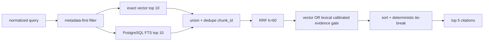

# SupportPilot — RAG Design

> Trạng thái: normative retrieval contract dẫn xuất từ [PLAN.md](./PLAN.md). Coding agent không được tự thay tokenizer, fusion hoặc confidence semantics.

## 1. RAG goals

- Truy xuất active policy/SOP phù hợp UC-01 với version, effective date và citation.
- Tách knowledge evidence khỏi transactional order/payment evidence.
- Cho kết quả deterministic/reproducible với exact model, input format, filtering, ranking và gates.
- Conservative no-answer/escalation khi evidence không đủ hoặc policy conflict.
- Hỗ trợ reindex/recalibration an toàn khi model/input/scoring thay đổi.

## 2. Dữ liệu dùng RAG

- Versioned payment synchronization policy.
- Policy metadata: type, region, language, category, effective range và lifecycle status.
- Bounded Markdown content chunks và headings.

## 3. Dữ liệu không dùng RAG

- Customer identity.
- Order/payment/shipment live state.
- Transaction references, card/provider secrets hoặc raw commerce records.
- Approval/action current state.
- Arbitrary web pages, URLs hoặc ticket-selected external sources.

Transactional evidence luôn đi qua typed HTTP tools. RAG không được dùng để tìm order hoặc payment.

## 4. Supported format và ingestion boundary

V0.1 chỉ nhận UTF-8 Markdown (`text/markdown`), tối đa 2 MB. PDF, DOCX, OCR và MIME khác bị từ chối. Ingestion tách khỏi normal Ticket request path; document chỉ publish sau validation/indexing.

## 5. Upload validation

- Auth: Admin.
- Validate extension + MIME = `text/markdown`.
- Validate UTF-8, max size, checksum, required metadata và malware status.
- Reject embedded/linked content that attempts to alter system/tool instructions; treat all policy text as untrusted content.
- Parser runs behind isolated adapter; no filesystem/tool authority exposed to LLM.
- Không publish partial/failed index.

## 6. Metadata contract

| Field | Required behavior |
|---|---|
| `policy_type` | Mandatory retrieval filter; UC-01 payment synchronization scope. |
| `title` | Required; included in passage input. |
| `version` | Required; unique within policy scope. |
| `effective_from`, `effective_to` | Required validity logic; UTC. |
| `region` | Metadata-first filter. |
| `language` | Metadata-first filter. |
| `product_category` | Specific category or `all`. |
| `heading_path` | Required chunk provenance; included in passage input. |
| `chunk_index` | Stable within document/index version. |
| `source_uri`, `checksum` | Source/version verification. |
| `status` | `DRAFT/VALIDATED/PUBLISHED/SUPERSEDED/EXPIRED`. |
| Embedding provenance | Provider/model/revision/dimension/input-format/index version. |

Optional domain metadata such as approval role/refund limit may exist only when milestone requires; v0.1 does not expand UC scope.

## 7. Parsing and normalization

1. Parse Markdown preserving section boundaries.
2. Normalize Unicode, whitespace and headings deterministically.
3. Extract title, heading path, version/effective metadata.
4. Do not let document text become system instructions or tool configuration.
5. Query and passage use the same documented Unicode/whitespace normalization policy.
6. Normalization policy is part of input-format version; changing it triggers reindex/recalibration.

## 8. Section-aware chunking

- Chunk within Markdown sections; do not merge unrelated policy sections solely to hit size target.
- `RAG_CHUNK_TOKENS=450` is target **content** tokens, not fixed size or whole-input cap.
- `RAG_CHUNK_OVERLAP=75` is section-aware overlap.
- Prefix, title, heading path, separators/newlines and content all count toward model context.
- Long title/heading reduces content budget; do not silently truncate prefix/title/heading.
- Whole encoded passage must not exceed exact model/revision context limit.

## 9. Exact tokenizer and embedding configuration

| Setting | v0.1 value |
|---|---|
| Provider | `sentence_transformers` local |
| Model | `intfloat/multilingual-e5-small` |
| Revision | `c007d7ef6fd86656326059b28395a7a03a7c5846` |
| Dimension | `384` |
| Input format | `e5-prefix-v1` |
| Normalize vectors | `true` |
| Device default | `cpu` |

Dùng tokenizer của exact model + exact revision; không dùng unpinned default hoặc “tương đương”. Runtime query input format phải khớp active index.

## 10. E5 input contract

### 10.1 Query

```text
query: {normalized_query}
```

### 10.2 Passage

```text
passage: {title}
{heading_path}
{chunk_content}
```

Newline/separator order là một phần của `e5-prefix-v1`. Query/passages đều encode bằng exact tokenizer/revision và vector normalization nhất quán.

## 11. Token-limit calculation

```text
passage_token_count = tokens(
  "passage: " + title + "\n" + heading_path + "\n" + chunk_content
)
```

`passage_token_count <= model_max_length` của exact revision. Chunker tính budget sau prefix/title/heading. Không giả định 450 là hard cap cho toàn input.

## 12. Embedding provenance

Mỗi chunk/index version persist:

- `embedding_provider=sentence_transformers`
- `embedding_model=intfloat/multilingual-e5-small`
- `embedding_revision=c007...5846`
- `embedding_dimension=384`
- `embedding_input_format_version=e5-prefix-v1`
- `index_version`
- document/chunk checksum

Query runtime rejects/makes index unavailable when provenance mismatches configured model/revision/dimension/input format.

## 13. PostgreSQL storage

- `support.knowledge_documents`: source/version/scope/effective/status/checksum.
- `support.knowledge_index_versions`: immutable terminal provenance/status, chunk count, `calibration_required` và failed attempt error; unique document/index version.
- `support.knowledge_chunks`: content/heading/checksum, `vector(384)`, FTS vector, full provenance và composite FK tới index version.
- `knowledge_documents.active_index_version` là completed-only pointer tới index của chính document; swap bằng transaction sau validation đầy đủ.
- Exact vector search in v0.1; no approximate index/reranker requirement.
- FTS uses PostgreSQL; no separate BM25 service.

Physical schema: [DATABASE_DESIGN.md](./DATABASE_DESIGN.md#8-knowledge-và-embedding-provenance-db-001c).

## 14. Deterministic retrieval pipeline



### 14.1 Metadata-first filters

Before either branch, require:

- policy type;
- region;
- product category;
- language;
- effective date;
- document status `published`.

Expired, superseded, wrong-version/wrong-scope chunks never enter candidates.

### 14.2 Vector branch

- Exact cosine search over filtered set.
- Top 10 candidates.
- Sort `vector_similarity` descending, then `chunk_id` ascending.
- Store raw similarity separately from ranking score.

### 14.3 Lexical branch

- Same filtered set.
- `plainto_tsquery('simple', normalized_query)`.
- `ts_rank_cd(search_vector, tsquery, 32)` as `lexical_confidence`.
- Top 10, sort confidence descending then `chunk_id` ascending.

### 14.4 Union and deduplication

Union rankings by `chunk_id`. A chunk present in both branches appears once but contributes both ranks to RRF.

## 15. Reciprocal Rank Fusion

```text
RRF(d) = Σ 1 / (k + rank_i(d))
```

- `RRF_K=60` development ranking parameter.
- Rank begins at 1.
- A chunk present in both branches gets both contributions.
- RRF only orders candidates.
- **RRF score is not evidence confidence.**
- RRF never replaces vector/lexical confidence gates.

## 16. Evidence confidence gates

A chunk can become citation/business evidence only if:

```text
vector_similarity >= RAG_MIN_SIMILARITY
OR
lexical_confidence >= RAG_MIN_LEXICAL_CONFIDENCE
```

- `RAG_MIN_SIMILARITY=0.72` is a development placeholder, not release threshold.
- Lexical gate has no meaningful release default before calibration.
- Both thresholds are selected only on the 15-case calibration subset.
- Gate applies before chunk is used as business evidence.
- Lexical exact match cannot bypass metadata/effective/version/status/conflict checks.
- Lexical-only below gate → no-answer/escalation.

## 17. Final ranking và top 5

After gating:

1. Sort RRF descending.
2. Tie-break vector similarity descending.
3. Then lexical confidence descending.
4. Then `chunk_id` ascending.
5. Return at most five citations.

No candidate passing a gate yields no-answer, not an ungated fallback.

## 18. Citation schema

Required safe fields:

- `chunk_id`, `document_id`, title, version, heading/path;
- bounded excerpt;
- effective from/to, status/scope where needed;
- branch ranks and vector/lexical scores;
- RRF ranking score clearly labeled ranking-only;
- evidence-gate result/branch;
- embedding provider/model/revision/dimension/input-format/index version;
- document/chunk checksum or safe provenance reference.

Citation may expose a single display `score` for compatibility, but UI/API must not label RRF as confidence. Full safe projection contract belongs in [API_CONTRACT.md](./API_CONTRACT.md#92-citation).

## 19. Policy lifecycle and versioning

- New document begins `DRAFT`, validates/indexes, then `PUBLISHED` atomically.
- Prior version becomes `SUPERSEDED`, not deleted.
- `EXPIRED` policies remain for historical audit but are excluded from current retrieval.
- Active retrieval requires unambiguous scope/effective period.
- Reindex creates new attempt/index version and swaps only after completion.

## 20. Policy conflict

If two active policies overlap the same scope/effective period without clear supersede relation:

- return both citations;
- set `policy_conflict=true`;
- escalate/manual review;
- do not let LLM select whichever text sounds more plausible;
- do not execute business action based on conflict.

## 21. No-answer behavior

Return no-answer/escalation when:

- no active chunk passes vector or lexical gate;
- top chunks do not support the condition being evaluated;
- citations lack version/effective date;
- active policies conflict;
- business API evidence is insufficient even if policy is clear.

No-answer is a safe product outcome and quality metric, not a retrieval exception to hide.

## 22. Reindex and recalibration rules

`POST /api/v1/knowledge/documents/{id}/reindex` yêu cầu Admin JWT + `Idempotency-Key`, chạy hoàn toàn synchronous trong v0.1 và success luôn trả `200 OK`. Không có `202`, background queue, job ID hoặc polling endpoint. Reindex không tự publish hoặc đổi document lifecycle.

Build flow:

1. Persist index attempt `BUILDING` với full embedding/input/scoring provenance; published document vẫn phục vụ active index cũ.
2. Parse/embed/write chunks dưới `new_index_version`, rồi validate count, checksums, dimension và provenance.
3. Chuyển attempt `COMPLETED` và atomic swap `active_index_version` trong transaction. `DRAFT/VALIDATED/PUBLISHED` status giữ nguyên.
4. Khi validation/runtime/timeout failure, persist attempt `FAILED` và error code nhưng giữ active pointer/index cũ nguyên vẹn.
5. Replay cùng principal/key/request hash trả exact persisted `200` body và không build lại; khác request hash conflict.

Success response bắt buộc: `document_id`, `document_version`, nullable `previous_index_version`, `new_index_version`, `reindex_status=COMPLETED`, unchanged `document_status`, `chunk_count`, `embedding_provider/model/revision/dimension/input_format_version`, `calibration_required`, `correlation_id`.

| Change | Reindex | Recalibrate |
|---|---:|---:|
| Model | Yes | Yes |
| Revision | Yes | Yes |
| Dimension | Yes | Yes |
| Prefix/field order/separators | Yes | Yes |
| Unicode/whitespace normalization/input-format version | Yes | Yes |
| Retrieval scoring/RRF behavior | When index representation affected | Yes |
| Golden dataset version | No corpus reindex by itself | Yes |

Any required change sets `RAG_THRESHOLD_CALIBRATED=false`. Release only accepts artifact matching exact model/revision/dimension/input-format/index/dataset/scoring config.

Error contract:

| HTTP/code | Retryable | Effect |
|---|---:|---|
| `404 KNOWLEDGE_DOCUMENT_NOT_FOUND` | false | No build/swap |
| `409 KNOWLEDGE_DOCUMENT_NOT_REINDEXABLE` | false | `SUPERSEDED/EXPIRED` or conflicting operation |
| `409 EMBEDDING_CONFIGURATION_MISMATCH` | false | Runtime/index contract mismatch |
| `422 REINDEX_VALIDATION_FAILED` | false | Failed attempt; active index unchanged |
| `500 REINDEX_EXECUTION_FAILED` | true | Failed attempt; active index unchanged |
| `504 REINDEX_EXECUTION_FAILED` | true | 120-second timeout; failed attempt persisted, active index unchanged |

## 23. Evaluation dataset split

Golden dataset target: exactly 25 versioned cases.

| Subset | Count | Rule |
|---|---:|---|
| Calibration | 15 | Retrieval ground truth; select/sweep vector + lexical thresholds. |
| Locked holdout | 10 | Final evaluation only after thresholds fixed; no threshold/RRF/prompt tuning. |

Calibration default strata: 5 relevant payment-policy, 4 vector/lexical variants, 3 expired/wrong-version/conflict, 3 irrelevant/no-answer.

Holdout default strata: 3 order-resolution/payment-policy, 2 version/no-answer, 2 approval/action, 3 timeout/malformed/prompt-injection/provider-failure. No semantic fixture overlap with calibration.

## 24. Calibration procedure

1. Commit dataset version/checksum and split manifest before threshold selection.
2. Embed/index with exact provenance.
3. Run vector/lexical score distributions on 15 calibration cases.
4. Sweep multiple thresholds; do not only test `0.72`.
5. Select both vector and lexical gates against target metrics.
6. Persist thresholds in versioned release artifact/environment.
7. Set calibrated flag true only after calibration pass.
8. Run locked holdout once. If failure requires change, create new evaluation version and repeat split/calibration; do not tune on holdout.

## 25. Metrics and release artifact

Separate calibration and holdout reports must record:

- dataset/subset version, checksum and split manifest;
- exact embedding model/revision/dimension/input format/index version;
- RRF parameter/scoring config;
- selected vector/lexical thresholds;
- Recall@5;
- no-answer precision;
- false-positive policy evidence count;
- relevant/irrelevant score distributions in calibration report.

Release targets:

- Payment-policy Recall@5 ≥90%.
- Holdout false-positive policy evidence = 0.
- No-answer precision meets the versioned target; PLAN does not currently prescribe a numeric value.
- If no threshold satisfies safety/quality, use conservative no-answer/escalation rather than weakening guards.

## 26. Environment contract

| Variable | Value/meaning |
|---|---|
| `EMBEDDING_PROVIDER` | `sentence_transformers` |
| `EMBEDDING_MODEL` | `intfloat/multilingual-e5-small` |
| `EMBEDDING_REVISION` | `c007d7ef6fd86656326059b28395a7a03a7c5846` |
| `EMBEDDING_DIMENSION` | `384` |
| `EMBEDDING_INPUT_FORMAT_VERSION` | `e5-prefix-v1` |
| `EMBEDDING_DEVICE` | `cpu` default |
| `EMBEDDING_NORMALIZE` | `true` |
| `RAG_CHUNK_TOKENS` | `450` target content tokens |
| `RAG_CHUNK_OVERLAP` | `75` |
| `RAG_TOP_K_CANDIDATES` | `10` each branch |
| `RAG_TOP_K` | `5` final |
| `RRF_K` | `60` ranking only |
| `RAG_MIN_SIMILARITY` | `0.72` development placeholder |
| `RAG_MIN_LEXICAL_CONFIDENCE` | replace after calibration |
| `RAG_THRESHOLD_CALIBRATED` | false until matching artifact passes |
| `KNOWLEDGE_REINDEX_TIMEOUT_SECONDS` | `120`; synchronous reindex request budget |

No `EMBEDDING_API_KEY` in v0.1; embedding runs local.

`0.72` không có ý nghĩa release sẵn có đối với `multilingual-e5-small`; đây chỉ là development placeholder và phải được hiệu chỉnh lại từ đầu trên 15-case calibration set thật. Không được đặt `RAG_THRESHOLD_CALIBRATED=true` hoặc release chỉ vì giá trị placeholder tồn tại.

## 27. Security considerations

- Markdown/policy text is untrusted and cannot register tools or change system instructions.
- Enforce admin upload/publish/reindex authorization.
- MIME/size/UTF-8/checksum/malware metadata validation.
- No arbitrary URL fetch or filesystem authority during parsing.
- Redact ticket/customer/payment data from query logs where unnecessary.
- Citation excerpt is bounded and safe; no raw secrets.
- Metadata filters are server-controlled; LLM cannot bypass effective/version/status.
- Prompt injection cannot alter tool allowlist, customer scope, approval or confidence gates.
- Historical expired policy access is scoped/audited, not active evidence.

## 28. Required tests

1. Same chunk in vector+FTS yields one citation and both RRF contributions.
2. High vector score but wrong policy version is filtered.
3. FTS exact match on expired policy cannot bypass filter.
4. Lexical-only match below lexical threshold returns no-answer/escalation.
5. Vector-only match above calibrated gate may become evidence.
6. Two active conflicting policies return both citations and escalate.
7. No candidate passing confidence gate returns no-answer/escalation.
8. Query/passages use exact prefixes, field order, tokenizer/revision and normalization.
9. Long title/heading shrinks content budget without exceeding context.
10. Input-format/provenance mismatch prevents mixed-index query and resets calibration.
11. Holdout cannot be used for threshold selection.
12. Prompt-injection Markdown cannot alter filters/tools/approval.
13. Reindex success returns exact synchronous `200` provenance response and never `202`/job/polling state.
14. Published reindex serves old active index until atomic swap; validation/runtime/timeout failure preserves old pointer and persists failed attempt.
15. Reindex does not publish `DRAFT/VALIDATED`; replay does not rebuild; embedding/input/scoring changes set calibration false.
16. Every reindex error returns the exact HTTP/code/retryability contract in §22.

## Source and traceability

- Nguồn chính: [PLAN.md](./PLAN.md), §7.4, §8.2, §12, §14–§15, §17–§20, §22–§24.
- Tài liệu liên quan: [DATABASE_DESIGN.md](./DATABASE_DESIGN.md), [API_CONTRACT.md](./API_CONTRACT.md), [AGENT_WORKFLOW.md](./AGENT_WORKFLOW.md), [SECURITY.md](./SECURITY.md), [TASKS.md](./TASKS.md).
- Quyết định không được thay đổi: Markdown-only; exact E5 model/revision/384/input format; local normalized embeddings; metadata-first vector top10 + FTS top10; RRF k=60 ranking-only; calibrated vector/lexical gates; top5; conflict/no-answer; 15/10 split; reindex/recalibration rules.
- Phiên bản nguồn: `PLAN.md` hiện không có version nội tại; traceability snapshot ngày 2026-08-04.
