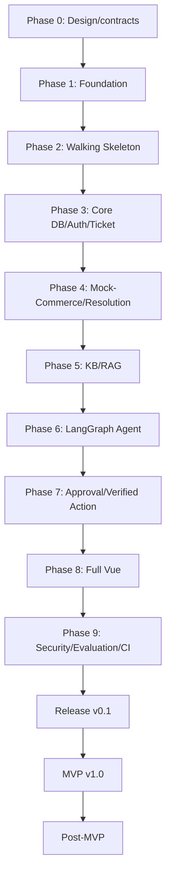

# SupportPilot — Roadmap

> Trạng thái: delivery sequence dẫn xuất từ [PLAN.md](./PLAN.md). Roadmap không cấp quyền mở rộng scope hoặc tự bắt đầu task.

## 1. Milestone overview

| Milestone | Scope | Entry/exit principle |
|---|---|---|
| Milestone v0.1 | Chỉ UC-01 Payment Mismatch end-to-end | Walking Skeleton → real HTTP/RAG/LangGraph/approval/action → quality/release gates. |
| MVP v1.0 | UC-01–UC-05 + ticket attachment/upload, PDF, refresh rotation, complete field encryption, advanced observability | Bắt đầu sau stable v0.1 và review scope/ADR. |
| Post-MVP | UC-06–UC-07, connectors, queue/scale/realtime/reranker khi có evidence | Bắt đầu sau MVP v1.0; không nằm v0.1 backlog. |

## 2. Phase roadmap

| Phase | Verifiable outcome | Depends on |
|---|---|---|
| Phase 0 — Design and contracts | PLAN-derived specs/ADR references consistent for API/state/schema/E5/RRF/checkpoint. | None |
| Phase 1 — Foundation | FastAPI/Vue/Compose shells, PostgreSQL roles/schemas/grants, two Alembic infrastructures/commands and optional empty baselines; no domain enum/table/seed. | Phase 0 |
| Phase 2 — Walking Skeleton | `SKEL-001` owns first minimal final-named PostgreSQL domain migration; Vue login → persist Ticket → fixed proposal → fake approve/reject/verified result. | Phase 1 |
| Phase 3 — Core database, auth and Ticket APIs | Full DB-001A, JWT/RBAC and real Ticket/message APIs replace demo internals. | Phase 2 |
| Phase 4 — Mock-Commerce and Order Resolution | Commerce schema/seed, HTTP Order/Payment APIs and deterministic resolution. | Phase 3 |
| Phase 5 — Knowledge Base and RAG | Markdown/E5 provenance, vector+FTS+RRF/gates and evaluation split. | Phase 4 |
| Phase 6 — LangGraph Agent | Checkpoint/run/events, v0.1 profile, deadline and same-run resume. | Phase 5 |
| Phase 7 — Approval and verified action | Alpha approve/reject/expiry/verify, then beta reviewer edit/reapproval; payment sync/`UNKNOWN`. | Phase 6 |
| Phase 8 — Full Vue review flow | Full Ticket/evidence/citation/timeline/approval/edit/error UX replaces skeleton views. | Phase 7 |
| Phase 9 — Security, evaluation, CI and release | ≥20 tests, 15/10 evaluation split, security/import/grant gates and clean Compose demo. | Phase 8 |

## 3. Dependency diagram



Task-level dependency registry: [TASKS.md](./TASKS.md).

## 4. Phase 0 — Design and contracts

- `DOC-001`: synchronize nine PLAN-derived documents and ADR references.
- Exit: no unresolved contradiction in scope/provider/schema/state/API; internal links/traceability pass.
- No implementation code.

## 5. Phase 1 — Foundation

- `FND-001`: FastAPI config/error/DI/quality shell.
- `FND-002`: Vue/Vite/TS/Router/Pinia/typed HTTP shell.
- `DB-000`: bootstrap schemas/owners/runtime roles/grants.
- `INF-001`: Compose order, two Alembic configs/commands/versions directories and optional empty baseline revisions.

Exit: final-shaped boundaries, empty least-privilege schemas and owner-isolated migration commands can host Walking Skeleton. Catalog assertions prove Phase 1 created no domain enum/table/seed.

Phase 1 không tạo domain migration, domain table, domain enum hoặc seed row; optional Alembic baseline phải rỗng.

## 6. Phase 2 — Walking Skeleton

`SKEL-001` is the first runnable vertical slice:

```text
Vue demo login
→ POST Ticket
→ PostgreSQL persistence
→ explicit Agent Run
→ fixed fake proposal
→ fake approve/reject
→ FakeAction VERIFIED (approve only)
→ Ticket result in UI
```

Out of scope: Gemini, embedding, RAG, full LangGraph, real commerce transaction, versioning/edit and payment sync.

Controls:

- Fakes only behind final interfaces/adapters.
- `SKEL-001` owns the first domain migration; it creates only final-named minimal `support.users/customers/support_tickets/ticket_messages` plus required enum/index.
- Migration runs on real PostgreSQL, never SQLite/in-memory, temporary/throwaway schema, RAG, commerce, workflow, approval or full schema.
- Same public endpoint/response/state names as final v0.1.
- `WORKFLOW_PROFILE=walking_skeleton` local/test only.

## 7. Fake component replacement sequence

| Order | Tasks | Replacement |
|---:|---|---|
| 1 | `DB-001A`, `AUTH-001`, `TKT-001` | Minimal persistence/demo auth → real core support data/auth/Ticket services. |
| 2 | `DB-002A`, `SEED-001`, `MOCK-AUTH-001`, `MOCK-ORD-001`, `MOCK-PAY-001`, `RES-001` | Fake evidence → exact Bearer-authenticated, customer-scoped HTTP commerce evidence and scorer. |
| 3 | `DB-001C`, `KB-001`, `KB-002`, `RAG-001` | Fixed policy → Markdown/E5/RRF gated citations and synchronous atomic reindex. |
| 4 | `DB-001B1`, `DB-001B2`, `DB-001B3`, `AG-001`, `AG-002A`, `AG-002B` | `FakeAgentAdapter` → checkpoint-backed v0.1 graph and exact physical persistence. |
| 5 | `APR-001`, `ACT-001`, `AG-003` | Fake approval/action → real approve/reject/expiry/idempotent sync/verify. |
| 6 | `APR-002` | Add immutable edit/material reapproval semantics. |
| 7 | `WEB-001`–`WEB-003` | Skeleton views/adapters → full review UI. |
| 8 | `CI-001` | Enforce no fake profile/path in release. |

## 8. Phase 3 — Core database, auth and Ticket APIs

Implementation order:

1. Extend skeleton migration forward-only in `DB-001A`.
2. Replace demo auth in `AUTH-001`.
3. Replace Ticket/message service in `TKT-001`, preserving public types.

Exit: explicit Ticket/create-run/message contracts can operate on final core persistence and RBAC.

## 9. Phase 4 — Mock-Commerce and Order Resolution

1. `DB-002A` adds only UC-01 commerce tables.
2. `SEED-001` establishes synthetic deterministic fixtures.
3. `MOCK-AUTH-001` enforces exact internal Bearer token, public/internal isolation and redaction.
4. `MOCK-ORD-001` and `MOCK-PAY-001` expose versioned HTTP contracts.
5. `RES-001` implements deterministic customer-scoped candidate scoring/clarification.

No direct SupportPilot commerce import/read is permitted.

## 10. Phase 5 — Knowledge Base and RAG

1. `DB-001C`: knowledge document/index-version/chunk schema, active pointer and embedding provenance.
2. `KB-001`: Markdown validation, parsing, section-aware E5 chunking/indexing.
3. `KB-002`: synchronous idempotent reindex `200`, atomic swap/failure preservation, no queue/auto-publish.
4. `RAG-001`: metadata-first vector+FTS top10, RRF k=60, calibrated gates, top5.
5. `TOOL-001`: allowlist/deadline/audit wrappers and internal-token-injecting HTTP adapter.

Calibration artifact is a release gate but does not block early skeleton construction.

## 11. Phase 6 — LangGraph Agent

1. `DB-001B1`: checkpointer + runs/events/evidence/tool calls.
2. `DB-001B2`: approval/proposal/action/notification persistence.
3. `DB-001B3`: append-only audit + generic support idempotency persistence.
4. `AG-001`: explicit run, checkpoint reconciliation, UC-01 guard/extraction/deadline.
5. `AG-002A`: HTTP-only order/payment evidence and clarification.
6. `AG-002B`: gated RAG, deterministic evaluation and grounded proposal.

No separate classification LLM; no hard-coded three Gemini calls.

## 12. Phase 7 — Approval and verified action

### 12.1 v0.1-alpha

- `APR-001`: approve/reject/24h expiry/role/expected version+hash/concurrency.
- `ACT-001`: revalidation, idempotent payment sync, `UNKNOWN`, fresh-read verification.
- `AG-003`: approval/message resume and deterministic final transition.

This replaces fake approval/action and proves real happy path. `APR-002` does not block alpha.

### 12.2 v0.1-beta/final

- `APR-002`: reviewer edit, material/non-material classification, immutable version/hash, TTL reset and reapproval.
- Final v0.1 still requires this behavior and its E2E/UI coverage.

## 13. Phase 8 — Full Vue review flow

- `WEB-001`: real login/Ticket/create-run/inbox/loading/error.
- `WEB-002`: detail/messages/evidence/citations/timeline polling.
- `WEB-003`: approve/edit/reject/expiry/stale/material reapproval UI.

Frontend retains skeleton public contracts and never exposes checkpoint/CoT/raw PII.

## 14. Phase 9 — Security, evaluation, CI and release

- `E2E-001A/B/C`: explicit trigger/timeout, approval/edit/unknown/verification and same-run resume.
- `E2E-001D`: ticket attachment omitted/empty compatibility and exact non-empty `422` zero-side-effect contract.
- `E2E-001E`: synchronous knowledge reindex `200`, atomic failure/replay/config-reset contract.
- `OBS-001`: basic JSON logs, run events, reconciliation and redacted audit.
- `SEC-001`: schema/customer/import/prompt/MIME/rate/redaction gates.
- `EVAL-001`: 25-case 15/10 calibration/holdout reports.
- `CI-001`: lint/type/test/build/security/import/evaluation and no-fake release gates.
- `DEP-001`: clean-machine local demo packaging/instructions.

## 15. Final v0.1 vertical slice

1. Customer logs in with demo account.
2. Vue creates Ticket and receives `ticket_id` without starting Agent.
3. Vue explicitly creates Agent Run; backend creates `CREATED`, Ticket `PROCESSING`, 60-second deadline.
4. Deterministic UC-01 guard + at most one structured extraction call.
5. Customer-scoped HTTP Order Resolution; ambiguous result pauses `WAITING_CUSTOMER`.
6. New message with omitted/`[]` attachments commits and resumes same run with fresh budget; non-empty references return `422` before commit/resume/fetch.
7. SupportPilot adapter injects exact internal Bearer token; no direct commerce access or credential exposure. HTTP order/payment evidence and active RAG policy citations are collected.
8. Deterministic engine creates immutable `sync_payment_status` proposal.
9. Graph interrupts `WAITING_APPROVAL`; reviewer sees evidence/impact/expiry.
10. Reviewer approve/edit/rejects with expected version/hash; material edit reapproves.
11. Valid approval resumes with fresh budget; backend revalidates and syncs payment idempotently.
12. Action result is fresh-read verified; possible write uses `UNKNOWN` reconciliation.
13. Only after `VERIFIED`, response persists and Ticket becomes `RESOLVED`.
14. Timeline/evidence/tool/approval/action and redacted audit persist; Vue polls final result.

## 16. Final release gates

- UC-01 only; synthetic `payment-mismatch-v01`; no UC-02+ implementation.
- Explicit create-ticket/create-run and same-run resume pass.
- Attachment contract passes: non-empty exact `422 ATTACHMENTS_NOT_SUPPORTED` and zero persist/fetch/resume side effect; no upload endpoint/table.
- 60s workflow, 5s reserve, 12s LLM attempt and 24h approval TTL tests pass.
- Ticket never resolves before verified approved action.
- Exact E5 provenance and deterministic RRF/gates pass.
- 15-case calibration + 10-case locked holdout reports pass; Recall@5 ≥90%, false-positive evidence 0.
- Minimum 20 automated tests; additions allowed.
- Grant/import/customer/security tests pass; unauthorized/duplicate actions 0.
- Internal auth matrix/redaction passes; public/internal credentials cannot cross boundary.
- Knowledge reindex is synchronous `200`, atomic/idempotent, does not auto-publish, and failures preserve active index.
- Clean Compose startup; runtime roles/credentials isolated.
- `WORKFLOW_PROFILE=v0_1`; no fake/fixed proposal path.
- No secrets, real customer data, CoT, PDF/queue/advanced out-of-scope feature.

## 17. MVP v1.0 and Post-MVP

MVP v1.0 begins only after stable v0.1 and explicit review: UC-02–UC-05, ticket attachment/upload, PDF, refresh rotation, complete field encryption and advanced observability.

Post-MVP begins after v1.0: UC-06–UC-07, real connectors and queue/scale/realtime/reranker when measured need exists.

No v1/Post-MVP task is inserted into the v0.1 implementation backlog.

## 18. Risks and mitigations

| Risk | Mitigation |
|---|---|
| Fake path leaks to release | Profile isolation + CI failure + replacement checklist. |
| Skeleton schema becomes throwaway | Final-named minimal columns; forward-only DB-001A migration/backfill. |
| Cross-app coupling | apps/packages layout, HTTP-only adapter, import/grant tests. |
| Wrong order/customer | Backend-injected scope, deterministic score/margin, masked clarification. |
| LLM latency/overreach | Simplified graph, 12s attempts/global deadline, structured schema, deterministic rules. |
| RAG false evidence | Metadata filters, calibrated gates, conflict/no-answer, locked holdout. |
| Checkpoint/run drift | Transaction/reconciliation markers, startup checks, audit/escalation. |
| Duplicate/unknown write | Row locks, unique keys, atomic commerce idempotency, `UNKNOWN` reconcile. |
| Approval stale/edit race | Version/hash/expiry/row lock/revalidation/reapproval. |
| Scope creep | Phase gates, explicit out-of-scope, PLAN/ADR review before change. |

## 19. Scope-control rules

- PLAN is authoritative; derived docs cannot alter architecture/state/API/schema/timeout/provider/RAG/approval.
- No UC-02–UC-07 implementation in v0.1.
- No Redis/Celery/Kafka/Kubernetes/background queue.
- No PDF/DOCX/OCR/real email/real customer data/refresh/encryption/advanced observability in v0.1.
- No ticket attachment implementation, storage, upload or URL fetch in v0.1.
- No unreviewed provider/model/revision/input-format changes.
- No task begins automatically after documentation.
- Any semantic change returns to PLAN/ADR review.

## Source and traceability

- Nguồn chính: [PLAN.md](./PLAN.md), §3, §20–§24.
- Tài liệu liên quan: [PROJECT_SPEC.md](./PROJECT_SPEC.md), [ARCHITECTURE.md](./ARCHITECTURE.md), [TASKS.md](./TASKS.md), [SECURITY.md](./SECURITY.md).
- Quyết định không được thay đổi: Phase 0–9 order; `SKEL-001` position; fake replacement; alpha/beta/final split; final release gates; v1/Post-MVP boundaries.
- Phiên bản nguồn: `PLAN.md` hiện không có version nội tại; traceability snapshot ngày 2026-08-04.
